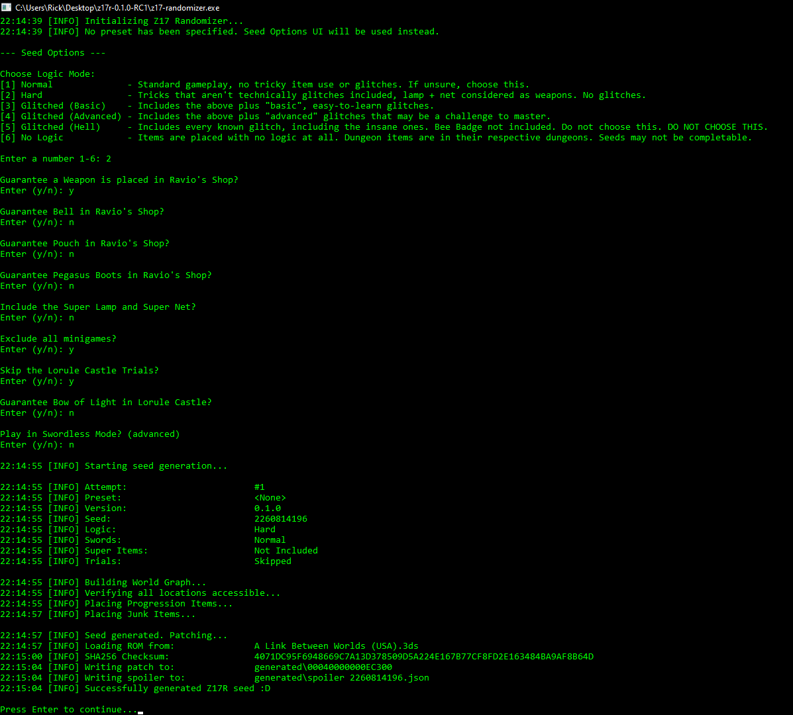
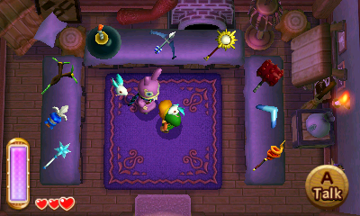

# Z17 Randomizer

A randomizer for The Legend of Zelda: A Link Between Worlds, built off the [original ALBW Randomizer](https://gitlab.com/marsolk/albw-randomizer).

## Updates

#### Version 0.0.4:
  - **FIX:** Prevent players missing the Big Key Chest in Thieves' Hideout.
    - Thief Girl will now remain in the dungeon even after completing it.
  - ROMs are now validated using an SHA-256 checksum prior to patching, and will provide better feedback when a ROM is not valid.
  - _True_ Double Ravio
  - Long Portal animation from Zelda's Study has been shortened
  - Sacred Realm cutscenes removed
  - Thief Girl Cave cutscenes removed
  - Kakariko rental cutscene removed
  - Blacksmith Wife cutscenes removed
  - Bye Seres

#### Version 0.0.3:

- Highlights:
  - Super Lamp and Super Net inclusion option added. These are progressive updates to the base Lamp and Net, meaning there will be 2 of each in the item pool if the option is enabled.
  - Maiamai Cave is open by default, bombs are no longer necessary.
  - The Curtain bug in Zelda's Study is fixed.
  - The Weather Vanes by Link's House and the Vacant House are pre-activated.
  - Many small cutscenes have been removed, most notably in the Dark Maze. Sorry Hilda Hey fans.

- Additional Changes:
  - The Inside Hyrule Castle dungeon door is now sealed shut. Remember, there is no need to enter this dungeon in this version of the randomizer.
  - A boulder was removed from the Donkey Cave to fix a potential vanilla softlock
  - Minor UI tweaks

#### Version 0.0.2:

- Highlights:
  - Introduction of Swordless Mode Option. I regret this already :^)
  - New options to place Bell, Pouch, and/or Pegasus Boots in Ravio's Shop
  - Expanded Glitched Logic to include more tricks in all dungeons
  - UI updates should provide more useful feedback when seeds fail to generate

- Additional Changes:
  - Smooth Gem is now locked to its original location in Kakariko (temporary fix for related bug)
  - Fix logic bug that could place Bracelet on Fire Cave Pillar in a Glitched No Bracelet seed
  - Removed `unsafe_key_logic` option. Please remove this from your presets.

#### Version 0.0.1:

- Highlights:
  - Portals to Lorule are open from game start
  - Start with Ravio's Bracelet option
  - Glitched Logic option
  - Ravio's Shop is fully open from game start
  - Maiamai are available to be collected from game start (still need bombs to turn them in)
  - Improved UI and auto-retry mechanism for seed generation

- Additional Changes:
  - All Hilda Text cutscenes have been skipped (except Dark Maze)
  - Skip Sahasrahla outside Link's House
  - Skip Ravio's Sign Trigger cutscene
  - Shady Guy and Merchant's right-side item are available from game start
  - Hyrule Hotfoot open from game start
  - Monster Guts/Horn/Tail initial pickup scenes skipped
  - Energy Potion initial pickup scene skipped
  - Fix Sahasrahla Softlock
  - Maiamai Map available by default
  - Map Swap icon available by default
  - Master Ore UI element present by default
  - Remove Standard Mode option
  - Experimental option "Night Mode" changes Hyrule's lighting until you visit Lorule. There are some performance issues on console, so not advised for races.

## Setup

Download: [Latest Stable Release](https://github.com/rickfay/z17-randomizer/releases/download/v0.0.3/z17r-0.0.3.zip)

1. Unzip the download to your directory of choice.
2. Move your A Link Between Worlds ROM into the same folder. Name it: `A Link Between Worlds (USA).3ds`
   - If your ROM is located elsewhere or if you'd like to name it something different, you can modify the `config.toml` file to point to the ROM instead

## Running the Randomizer

There are two ways you can run Z17R:

1. Double click `z17-randomizer.exe` to start the randomizer with basic settings. The randomizer will provide a simple interface for setting game options, after which it will attempt to generate a completable seed.
   - The randomizer may make multiple attempts to generate a completable seed. This is normal, and will happen automatically.

2. Use a command line interface. If you take this approach you may also specify a preset and/or seed to use for seed generation.
   - Using a preset will give you some additional options and allow you to manually configure excluded checks.
     - See the example `presets/Standard.toml` for more information.
   - Note that the randomizer looks in the local `presets` directory now, and does NOT check `AppData`
   - Examples:
     - `$ ./z17-randomizer.exe --preset racerman`
     - `$ ./z17-randomizer.exe --seed 4057320268`

## Installing Seeds

After you've generated your seed in the above section, you'll need to install it in order to actually play the randomizer.

The randomizer will generate a folder called `00040000000EC300`. This folder is the patch you need to install to play your seed.

For 3DS hardware:
- Copy `00040000000EC300` to `/luma/titles` on your SD card.
- Ensure that `Enable game patching` is selected in Luma's config (this can be opened by holding `Select` when powering on the console).

For Citra (emulator):
- Copy `00040000000EC300` to `<Citra folder>/load/mods/`. You may need to create these folders.
- You can find the Citra folder by selecting `File > Open Citra folder...` in Citra.

## Game Options

`start_with_bracelet`
- Causes Ravio to give out the Bracelet at the start of the game. More specifically, the Bracelet will be placed in the Bow Item's Slot in the shop, and Ravio will give you the item on that slot.

`bell_in_shop`
- If enabled, guarantees the Bell will be placed in Ravio's Shop.

`pouch_in_shop`
- If enabled, guarantees the Pouch will be placed in Ravio's Shop.

`super_items`
- If enabled, includes the Super Lamp and Super Net in the shuffled item pool as progressive upgrades to the base Lamp and Net.

`glitched_logic`
- Enables items to be placed in locations that may require glitches/tricks to obtain. A complete list of potentially required glitches/tricks is below.

`minigames_excluded`
- Excludes Cucco Rush, Hyrule Hotfoot, Treacherous Tower, Octoball Derby, and both Rupee Rush minigames from having progression.

`swordless_mode`
- Generates a seed with no Swords. Things you should know about Swordless:
  - The 2 Chests in Hyrule Castle are unobtainable, but they are excluded from containing progression.
  - You will need the [Net to play Tennis with Yuganon](https://www.twitch.tv/videos/1265170513). Good luck finding it!

#### The following options are only available when creating a seed using a preset:

`boots_in_shop`
- If enabled, guarantees the Pegasus Boots will be placed in Ravio's Shop.

`dont_require_lamp_for_darkness`
- If enabled, the logic may place required items behind completely dark rooms without giving you the Lamp first.

## Glitched Logic Breakdown

The following tricks may potentially be required in a Glitched Logic seed:

- Lamp, Net, and Pegasus Boots are considered damage sources
- Rosso Cave with Boomerang or Hookshot (not TRod + Shield)
- Blacksmith Cave with Fire Rod or Nice Bombs
- Reach Death Mountain with Power Glove Skip
- Eastern Ruins Pegs with Boomerang or Hookshot or Tornado Rod (no Sand Rod)
- Flipperless Message in a Bottle with Fire Rod or Nice Bombs
- Access HoG with Fake Flippers or Ice Rod + Hookshot
- Lost Woods Chest with Boomerang or Hookshot and a means of escape (FRod, Bombs, or Bell. No Crow)
- Reverse Sanctuary (door is open after opening Gravestone, just need damage source to defeat Poes)
- Flippers Treasure Dungeon tricks. Need either Titan's Mitt or Ice Rod to enter. Then either just Hookshot + Flippers OR simply the Nice Bombs. Nice Ice Rod and Great Spin not considered.
- Zora's Waterfall Cave with the Crow Boost (FRod not needed)
- Pegasus Boots Dungeon with just Master Sword, Bombs, or Boomerang (Nice Bow and Nice Ice Rod not considered)
- Access Turtle Rock with Fake Flippers
- Misery Mire HP without Sand Rod. With just Bombs (regular works with Vulture boosting) or FRod + Boots
- Eastern Palace
  - Left entrance chest with a thrown Pot
  - 4 Switches Room with thrown Pots
  - Bombs to activate switch opening path to Boss Door early
  - TRod Armos Boost to get to Boss Key or Boss room without the appropriate key
- House of Gales
  - 2F Fire Ring Key using HoG Skip Skip to do 2F backwards if key missing (incredibly specific, unlikely)
  - Skip Skip Skip to reach 3F without keys
- Tower of Hera
  - Bomb Rods can be used to climb the tower without any keys
- Swamp Palace
  - Early access to 1F SW/SE rooms with Ice Rod to raise water level
  - Miniboss Skips with Ice Rod/Tornado Rod or Boots
  - Early Big Chest with Ice Rod or Boots
  - Big Key Skip with Ice Rod and Tornado Rod
- Thieves' Hideout
  - Flipperless Thieves using TRod + a way to hit the switch (IRod or Bombs, no sword beams)
    - Softlock chest behind wall NOT in logic unless you can also get Bombs or Fire Rod (but really, bring a Scoot Fruit)
    - Big Key chest accessible, Boots made available
- Ice Ruins
  - All dungeon checks accessible without keys if you have Boots. The ones behind B1 locked doors also require Tornado Rod.
- Desert Palace
  - Reverse DP means keys can show up anywhere in the dungeon if you have Fire Rod or Nice Bombs
- Turtle Rock
  - Big Key Skip using a Bomb Rod
- Lorule Castle
  - Lamp Trial doesn't need the Lamp

  
Mergeless Tricks if `start_with_bracelet` is false:
- Behind Blacksmith with Fire Rod or Nice Bombs
- Death Mountain climb
- DM Fairy Cave with Fire Rod or Nice Bombs
- Bouldering Guy with TRod + Boots
- Access Eastern Ruins with just Power Glove
- Eastern Ruins Merge Chest with TRod, FRod, or Nice Bombs
- Lost Woods Alcove with Boomerang or Hookshot and a means of escape (FRod, Bombs, or Bell. No Crow)
- House of Gales TRod onto moving block in 1F East Room (if key logic allows access)
- Mergeless Hera with Bombs and Sword to bypass lobby. TRod needed for floors higher than 3F

Fake Flippers requires Pegasus Boots and either Fire Rod or Nice Bombs

Some notes about Nice Bombs:
  - Glitched logic *DOES* guarantee at least 10 Maiamai will be available for any checks requiring Nice Bombs
  - The logic guarantees Nice Bombs are obtainable for any Bomb Rods or Lemon Boosts
  - If you spend your Maiamai on anything other than Nice Bombs, you may potentially doom your seed. Regular Bomb boosts may save you, but if progression is on Southern Ruins Treasure Dungeon with Nice Bombs there's no salvaging it. YOU HAVE BEEN WARNED.

## Known Issues

- Bow of Light crashes the game if used outside the final boss arena (on console)
- After Ravio gives out the Bracelet from the Bow Item Slot in his shop, the model remains until you leave and reenter.
- Despite Maiamais being available for collection from game start, the Maiamai cave itself is still sealed shut and thus Bombs are still required to turn in any Maiamai
- Opening the Portals early has some side effects:
  - The Curtain over the Hyrule Castle Portal is not torn down, so if you attempt to enter the Portal right before the final boss fight, you'll notice some... odd behavior. This is NOT a softlock, but it is confusing. If you have the Lamp you can use it to burn down the Curtain from behind it. Otherwise you'll eventually void out and return to Lorule Castle.
  - The Yuga 2 Boss fight can be started but Yuga 2 cannot be defeated. If you do enter the boss arena, you'll find that Yuga gets stuck circling the room in his merged form, but that because the entrance door is opened he just stalls. Defeating Yuga 2 is no longer necessary as Portals are open, so you can just leave.

## Future Plans

Time and technical knowledge (or lack thereof) are the main barriers to future progress, but I will share my wishlist of features to eventually add:

- Keysanity
- Shuffled Pendants and Paintings
- Portal Randomizer
- Include Nice Items as Progressive Items
- Randomize Maiamais
- Randomize Maiamai Rewards for 10, 20, 30, etc.
- Great Spin
- Hyrule Hotfoot, preclear the first race
- Treacherous Tower, preclear the first round
- Fix existing Known Issues
- Other Stuff TM

## Special Thanks

- Tocapa for building the original ALBWR foundation this hack is built from
- My Beta Testers: Br00ty, j_im, flora, and Herreteman

## License

This program is licensed under the GNU General Public License v2.0.
