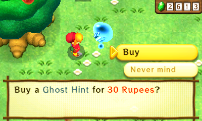
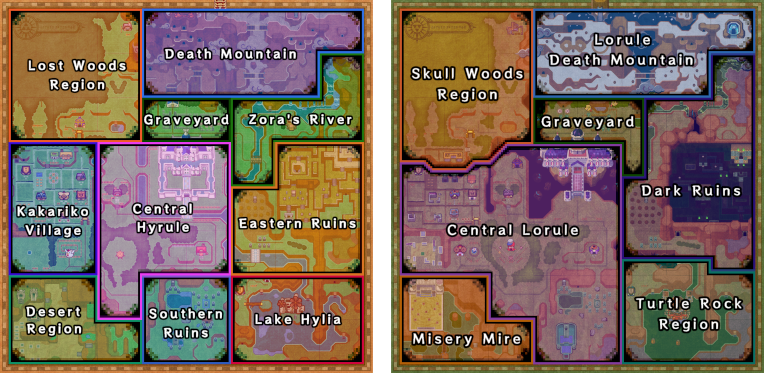

# A Link Between Worlds Randomizer
A randomizer for The Legend of Zelda: A Link Between Worlds, built off the [original](https://gitlab.com/marsolk/albw-randomizer).

<br />
<p align="center">
  
</p>

## Updates
<details open="open">
<summary>Version 0.4</summary>

- **Portal Shuffle**
  - There are 56 Portals in the game split into 28 pairs--and now they can take you anywhere!
  - Read the section for more deatils: [Portal Shuffle](#portal-shuffle)
- **Quake**
  - Games will now start with most Portals closed, until players find the new item that opens them: the Quake Medallion.
  - The Hyrule Castle Portal is the only Portal open without Quake, and may be required to use if Quake is placed somewhere in Lorule.
    - Only the Portal connected to Hyrule Castle will be open in Lorule.
    - If Portal shuffle is enabled, the HC Portal may lead to any Portal in Lorule and therefore Quake may appear nearly anywhere in Lorule.
  - Players may optionally choose to start with Portals already open, in which case Quake will be omitted from the item pool.
- **Weather Vanes**
  - **Pair Shuffle**: Groups Weather Vanes into random pairs that unlock each other instead of themselves.
  - **Convenient**: Activates the Vanes that don't affect logic
  - Activate All Hyrule Weather Vanes
  - Activate All Lorule Weather Vanes
- **Skip Trials &rarr; Trial's Door Setting**
  - Select 1-4 LC Trials to randomly enable.
  - Or set the door to always be Open.
    - Careful: enabling this also creates an early path into Lorule Castle via its Portal.
- Keysy
  - Small
  - Big
  - All
- Hint Ghosts
  - Faster
  - Free
- Eastern Palace chest icons that would normally only appear after defeating the boss will now appear beforehand (if you have the Compass).
- Rosso has been fixed, no more Crooked Chest in his house.
- Gameplay Changes:
  - Charm
    - The Charm is no longer a dungeon prize, and Hyrule Castle will no longer house a random dungeon prize as a reward.
    - The Charm is still in the item pool, but does nothing. It is not progressive and is independent of the Pendant of Courage.
    - Zelda will give out a random item in the Hyrule Castle throne room.
  - RSE Nerfs:
    - Impa no longer locks Hyrule Castle's front door.
    - The Shady Guy Event (and its 2 related checks) are no longer locked by Oren.
  - Ice Ruins:
    - A non-missable copy of the missable torch that opens the door on B3 has been added next to the East tongue statue.
      - This is a QoL change made to address a randomizer-only problem where the 3rd Small Key Door is opened earlier than the vanilla game intends.
      - This prevents players from needing to fall carefully to avoid the wind current.
      - This has no impact on logic.
  - Hyrule Castle
    - After rescuing Impa the enemy soldiers will disappear and Impa, the Official, and Soldiers will reappear.
    - Impa now locks the vanilla Charm check.
  - Inside Hyrule Castle
    - No longer requires the Pendant of Courage (either) to enter, just Master Sword.
  - Lorule Castle
    - The state of the Trials Door in Hilda's Study will now match the same in the Lorule Castle dungeon.
    - If the player has not rescued all the Sages, the loading zone to Yuganon will instead drop the player at the Blacksmith's.
      - Once all Sages are rescued the path to the Lorule Blacksmith remains open via newly placed green Warp.
      - A courtesy "return" Warp will appear in the Lorule Blacksmith if it is entered from LC.
  - Thieves' Hideout Big Key Chest:
    - After defeating Stalblind the shield device used to reach the chest will activate automatically.
    - Previously Thief Girl had been rigged to stick around to address this issue. That solution has been replaced by this one.
  - Treacherous Tower:
    - Reworked into a single check given by a single mode with a random selection of floors from all difficulties.
    - Can choose how many floors the tower has (2-66).
- Logic Changes:
  - All:
    - Dungeons now expect a certain amount of health to be available before entering logic.
  - Normal:
    - Knucklemaster, Zaganaga, and Yuga Ganon each now logically require the Master Sword to defeat
    - The Merge Chest on the right side of the Eastern Palace lobby now logically requires that dungeon's Compass.
    - The Hidden Chest on Ice Ruins 1F now logically requires that dungeon's Compass.
    - The Ice Rod or Bombs are now considered viable ways to activate the Eastern Palace switch(es) that activate the bridge to the Boss Door.
    - The Misery Mire Ledge is now considered logically accessible with the Stamina Scroll as an alternative to the Sand Rod.
    - The Dark Palace right-side entrance chest no longer logically requires Lamp
    - House of Gales 1F Northwest chest no longer requires Merge or an escape item.
    - Ice Ruins logic updated to consider B3 crystal switch.
  - Glitched:
    - The new Sandcastling trick makes it possible to complete the Misery Mire Treasure dungeon without the Tornado Rod.
  - Hell:
    - The new Sand Hopping trick has been added. It allows completing the Hyrule portion of Desert Palace without Merge and reaching the 1F miniboss chest without the Titan's Mitt.
- Rupees will now be named correctly in shops instead of being referred to as "Play Coins"
- Eastern Palace map icons for "escape" chests will now appear before defeating the boss.
- Path Hints will now explicitly list their underlying Path Item in the Spoiler Log.
- Hints should overall generate more quickly.
- Spoiler Logs can now be used as preset files to simplify seed sharing.
- Misc. Text Improvments:
  - Bee Guy
  - Hint Ghosts (sped up, less text if price is free)
  - Impa / Soldier
  - Mother Maiamai
  - Ravio
  - Rosso
  - Stylish Woman
  - Thief Girl
  - TR Turtles (Tallo, Jillo, and Sabro)
  - Witch
  - Woman

</details>

<details>
<summary>Version 0.3.1</summary>

- Always Hint pool expanded to include most checks that are locked behind Dungeon Prizes.
- Fix vanilla Letter in a Bottle location check to not disappear under certain conditions.
- Minor tweaks to some location names

</details>

<details>
<summary>Version 0.3.0</summary>

- <u>Dungeon Rewards Shuffled</u>
  - The 7 Sage Portraits & 4 Pendants are now randomly shuffled between the Hyrule and Lorule dungeons.
  - Maps will show a red X over uncompleted Portrait dungeons.
- <u>Hint System</u>
  - ZOOTR-style Path Hints are now generated with seeds!
  - See the [Hint System](#hint-system) section below for more details
- <u>Progressive Pendant of Courage</u>
  - The Pendant of Courage is now a Progressive Item that will appear in *two* dungeons.
  - The first one found will be the Charm, an item that does nothing by itself
  - The Charm's vanilla location in Hyrule Castle will contain a shuffled Sage Portrait or Pendant
- <u>New Major Settings</u>
  - Nice Mode
    - Shuffles a second progressive copy of every Ravio item into the pool.
    - Collect both to get that item's Nice version.
    - Note: For now, enabling this setting will remove the Mother Maiamai Cave from the game.
  - Reverse Sage Events
    - Causes checks and events related to a specific Sage to be tied to first rescuing that Sage.
  - No Progression Enemies
    - Removes enemies that are themselves progression, such as the small green Bomb enemies.
    - Increases the items required to get through several dungeons.
- <u>Hyrule Castle Complete Overhaul</u>
  - HC has been revamped and returned to its vanilla roots:
    - Pendant of Courage is required to enter the "Inside Hyrule Castle" dungeon
    - No longer a merge-free path to Lorule
  - Completing HC rewards players with early access to:
      - Lorule Castle via the Trials Door
        - Taking the Portal to Hilda's Study will automatically mark the LC Trials as complete.
      - Throne Room (Final Boss Room)
        - Yuga Ganon will not spawn unless Portrait requirements are met
  - Option to disable the Hyrule Castle Dungeon entirely
- <u>Custom Portrait Requirements</u>
  - Lorule Castle: Choose how many Portraits are needed to enter the dungeon's front door.
- <u>Great Spin</u>
  - Now available! Great Spin has been added to the general item pool
  - Works with the Forgotten Sword (impossible in vanilla)
  - The bug related to losing Great Spin if obtained before Forgotten Sword has been resolved with an ASM patch
- <u>Chest Size Matches Contents option</u>
  - Turns all chests containing Progression into large chests, and all others into small chests.
  - Note: Some large chests have altered hitboxes to prevent negative gameplay interference.
- <u>Newly Randomized Checks</u>:
  - **Zelda's Throne in Hyrule Castle**
    - A Sage Portrait or Pendant will be here every seed
  - **Blacksmith Table**
    - This was the Captain's Sword package for delivery in vanilla, it'll be a chest on the table
  - **Cucco Dungeon**
    - ALttPR runners will know this as Cave 45. Our version has a freestanding Silver Rupee that will now be a random item.
  - **Ku's Domain Fight**
    - This is the Zora's Domain area, but in Lorule. For technical reasons, this will be a chest.
  - **Woman**
    - Rescue the Maiamai on her roof in Kakariko and then talk to her to get a reward.
    - (Yes... that's really her name.)
- <u>Bottle Trade Item Changes</u>
  - Only one of the bottle trade items (Letter or Premium Milk) will now be randomized.
    - If you get the Letter in a Bottle, bring it to the Milk Bar to receive Premium Milk.
    - If you get Premium Milk, you can skip the bar and go directly to the Bouldering Guy.
  - Bouldering Guy will empty your bottle (making it usable) AND give you a random item.
  - All bottled items should now display correctly in the player inventory.
- <u>Great Rupee Fairy</u>
  - Automatically throw 3000 rupees as one action!
- <u>Item Hash</u>
  - On the File Select Screen and in your spoiler log you will now find a 5 character Item Hash that you can compare with other players to be confident you are playing with the same Seed and Settings.
- <u>Several cutscenes shortened/reworked</u>
  - Triforce of Courage cutscene is notably skipped.
- <u>Logic Adjustments</u>:
  - Irene + Shady Guy events return
    - Their cutscenes are not instant, but they are greatly shortened
  - Rosso's House starts locked again
    - Needs Pendant of Courage to unlock (or Rosso if playing with the new RSE Setting)
- <u>Night Mode Improved</u>:
  - The effect no longer disappears when entering a Portal and will last indefinitely.
- <u>Spoiler Log</u>:
  - New Playthrough section
      - Shows Sphere-by-Sphere logical path through seed.
      - Note: For readability, minor progression (Rupees, Maiamais, Health, Events) items are omitted.
  - Formatting improvements, should be easier to read.
- <u>Fixes</u>:
  - Pedestal requirements are properly enforced.
  - Chests containing the Compass in vanilla will now show up on their respective dungeon maps.
  - Softlock prevention added to Gales to prevent players from getting locked into the 1F miniboss.
  - Swamp Palace anti-softlock measures have been reversed.
  - Misc. textbox changes and fixes

*All changes from the unofficially released v0.1.3 have been folded into this update.*
</details>

<details>
<summary>Version 0.1.3</summary>

- Maiamai Madness
  - This shuffles all Maiamai locations into the pool, adding 100 new checks.
  - Thank you to Gamestabled for the ASM contributions that made this possible!
- The Filler Algorithm has been adjusted to help un-bias early game locations.
  - Big Keys, Small Keys, and Compasses are now placed before all other forms of progression.
  - As a bonus, seed generation is now much more likely to be successful on the first try and is therefore faster.
- Glitched Logic modes will no longer pre-open the Maiamai Cave
  - This is to hopefully prevent players from getting a Nice item that's not Nice Bombs first
- Pre-activated Weather Vanes Option (Experimental)
  - This allows skipping many overworld item requirements and also for all regions of Lorule to be explored without Merge.
- Logic Adjustments:
  - Hard Logic no longer requires players to get Nice Bombs.
    - This was potentially needed to climb Hyrule Castle, but going forward only Glitched logics will require players to get Nice Bombs.
  - Lost Woods clip to get Big Rock Chest has been moved to Glitched Hell Logic.
  - Thieves' Hideout B1 with just Bombs has been moved to Glitched Hell logic.
  - Thieves' Hideout B1 with Boomerang + Boots added to Glitched Basic, or just Boomerang to Glitched Advanced.


</details>
<details>
<summary>Version 0.1.2</summary>

- Added back the non-required Lamp option: `lampless`. If enabled during seed generation, the logic may require the player to cross dark rooms without a light source.
  - A slightly more verbose description was added this time to hopefully prevent new players from enabling this by mistake.
- **LOGIC FIXES**:
  - House of Gales miniboss can't be defeated by a fire weapon (all logic)
  - Lamp and Net weren't being considered as weapons in a few places (Hard Logic)
  - Hookshot Treasure Dungeon can be reached without merge, but not completed without merge (Glitched Advanced)
  - Thieves' Hideout mergeless glitched logic was... who wrote this? Me? Oh. Well it's fixed now. (Glitched Basic/Advanced)
- **FIXED:** Bouldering Guy
  - The Bouldering Guy will now stay on his ledge on Death Mountain if you have collected the Letter in a Bottle but not yet turned it in.
- **FIXED:** The `bow_of_light_in_castle` option now fully respects the exclusion list.
  - There was previously special handling to make sure Bow of Light wouldn't land on Zelda if she was manually excluded, but it failed to consider any other check in Lorule Castle players might have excluded. This has been corrected, so if you exclude e.g. the Eyeball Chest while using this setting it's now guaranteed to not have Bow of Light (or any progression).

</details>
<details>
<summary>Version 0.1.1</summary>

- **FIXED:** Desert Palace Key Logic
- **FIXED:** Normal Logic Swordless Mode bug

</details>
<details>
<summary>Version 0.1.0</summary>

- New Filler Algorithm:
  - This has been a long time coming :)
  - The filler has been completely rewritten using an **Assumed Fill** algorithm. The old algorithm had a tendency to front-load progression items in the Overworld (often just Hyrule's), and very rarely put anything noteworthy in dungeons. This new algorithm fixes those problems and produces interesting "logic chains" with a much higher frequency.
  - The vanilla Bow of Light issue has been solved once and for all! The new filler has no biases towards Zelda, and excluding her prevents her from having any progression at all.


- Hyrule Castle + "Yuga Seeds"
  - After a lot of remodelling, Hyrule Castle is open once again!
  - Defeating Yuga 2 awards a unique type of progression: Access to Lorule **without Ravio's Bracelet**. This makes it possible for the Bracelet or an item leading to Bracelet to spawn in the main area of Lorule, including the early portions of Thieves' Hideout and Swamp Palace.
  - To accomplish this, the north exit from the Yuga 2 boss fight has been redirected to drop Link into the Lorule Blacksmith. This door will remain open if the player needs to use it multiple times.
  - Note 1: Climbing Hyrule Castle logically requires the Bow or the Ice Rod to kill the Red Spear soldier mergeless on 3F. It can also be done with Nice Bombs (Hard Logic, see below), or the Nice Tornado Rod (not in any logic).
  - Note 2: If you need to return to Hyrule after reaching Lorule in this way, you need to death warp to return to Link's House. We're exploring more *elegant* ways to do this in the future, but this is what we have for now.
  - Note 3: Swamp Palace was really not designed for the player to not have merge, with three rooms capable of softlocking the player if they unwittingly entered mergeless. To combat this, 2 doors that normally shut behind the player have been removed. Additionally, the crystal switch in the B1 north room that would normally divert the river has been removed, preventing a softlock that could otherwise occur (the switch was never needed, players could always bypass the river by merging).


- New Logic Modes
  - The logic has been expanded into six (6) different modes. Hopefully there's something for everyone.
    - <u>Normal</u>: Standard gameplay, no tricky item use or glitches. If unsure, choose this.
    - <u>Hard</u>: Adds tricks that aren't technically glitches, lamp + net considered as weapons. No glitches.
    - <u>Glitched (Basic)</u>: Includes the above plus "basic", easy-to-learn glitches.
    - <u>Glitched (Advanced)</u>: Includes the above plus "advanced" glitches that may be a challenge to master.
    - <u>Glitched (Hell)</u>: Includes every known RTA-viable glitch, including the insane ones. DO NOT CHOOSE THIS.
    - <u>No Logic</u>: Items are placed with no logic at all. Seeds may not be completable.

  - A full breakdown of the new logic modes is located further down this page.


- Sanctuary, Rewired
  - The doors to the Sanctuary church are now closed at game start. They will open upon completing the Sanctuary dungeon, specifically when the left-side switch is pulled at the dungeon's end.
  - This change effectively locks the Lorule Graveyard behind completing the Sanctuary, meaning players have a reason to collect the key, fight the miniboss, and actually finish the dungeon now.

  
- Ravio's Bracelet Changes
  - The second Bracelet has returned to the item pool, meaning you must find both before you can Merge.
  - The `start_with_bracelet` option has been deprecated. The option mostly existed to cover for the old filler algorithm's shortcomings, but now that those have been addressed the option is being retired.


- Pendant of Courage Changes
  - Rosso's House has been unlocked from game start and the check for smashing his pet rocks is logically available anytime after you've obtained the Power Glove.
  - The Irene check has been removed entirely. This check with its multiple invisible triggers caused a lot of confusion for players, so for now we've decided to remove it.
    - Don't worry, you'll still be able to see Irene on her broom after you've rescued her portrait.
  - This leaves the Haunted Grove Tree Stump as *the* Green Pendant-locked check.


- Swordless Mode Changes
  - The Hyrule Castle Barrier will now be removed when playing on Swordless Mode, granting access to 2 otherwise inaccessible chests and the Hyrule Castle dungeon.
  - Yuga 2 can still be fought in Swordless Mode to access Lorule without Bracelet, but note that he cannot be harmed with the Bow alone.


- New Option: `assured_weapon`
  - Guarantees at least one weapon will be placed in Ravio's Shop
    - Items include: Bow, Bombs, Fire Rod, Ice Rod, Hammer, Sword (if not playing Swordless), or Lamp/Net (if playing on Hard Logic or higher)


- New Option: `bow_of_light_in_castle`
  - Guarantees Bow of Light will spawn on one of the 15 checks inside Lorule Castle.
    - Note: This includes Zelda, unless you manually exclude her.


- Change to *`_in_shop` settings:
  - When the Bell, Pouch, Boots, or an assured weapon is placed in Ravio's Shop, it will now be placed on a random slot (but never the Sand Rod Slot).


- Letter in a Bottle pickup text has been removed


- Great Rupee Fairy will now logically guarantee (at least) 3000 Rupees are available between placed Purples, Silvers, and Golds.
  - This change is intended to prevent players from having to grind large amounts of rupees in the early game.


- The randomizer will no longer generate a `Standard.toml` preset that overwrites itself. Instead, an ~~`Example.toml`~~ `Example.json` preset is provided to demonstrate the correct format, and you may modify or delete it ~~at your own peril.~~


- **FIXED:** Vanilla Bow of Light
  - The new filler is not biased towards giving Zelda the Bow of Light.
  - Excluding Zelda is now *guaranteed* to prevent a vanilla Bow of Light placement.

  
- **FIXED:** Smooth Gem
  - The issue preventing players from giving Oren the Smooth Gem has been
    - (•\_•)
    - ( •\_•)>⌐■-■
    - _smoothed out_
    - (⌐■_■)
    - _YEAAAAHHHHHHHHHHH_
 

- **FIXED:** Skull Woods Softlock
  - It was technically possible to get softlocked in the hallway outside the Skull Woods boss if the player reached it without the Lamp, Fire Rod, Bombs, a Scoot Fruit, or the dungeon's Boss Key. There are no reports of this happening as it would require navigating Skull Woods completely in the dark while being unlucky enough to have none of those items, but it was technically possible. The fix prevents the door closing behind the player when they enter the hallway, allowing them a means of escape.


- **FIXED:** Duplicate/Wrong Enemies in Hyrule Field
  - The enemies present in Hyrule Field should now be those typically present in the vanilla game after beating Eastern Palace and opening the Portals to Lorule. The seemingly random duplicates in certain areas have been removed.


- **FIXED:** Kakariko now has the correct number of NPCs and Cuccos.


- **ALTERED:** The rock used to perform Trial's Skip in Lorule Castle will now respawn after leaving and re-entering the room. This is to keep Trial's Skip doable in the event the rock is accidentally destroyed.

</details>
<details>
<summary>Version 0.0.4</summary>

  - **FIX:** Prevent players missing the Big Key Chest in Thieves' Hideout.
    - Thief Girl will now remain in the dungeon even after completing it.
  - `skip_trials` option added. Removes the Trials Door in Lorule Castle if enabled.
  - `boots_in_shop` promoted to a UI option instead of requiring a preset to use.
  - Glitched logic now considers using the Ice Rod to reach the Eastern Palace Boss door.
  - Long Portal animation from Zelda's Study has been shortened.
  - The following cutscenes have been removed:
    - Zelda in the Sacred Realm
    - Thief Girl Cave
    - Kakariko Girl/Papa (if you didn't get anything from Ravio)
    - Blacksmith's Wife
  - The randomizer now calculates your ROM's SHA256 checksum for troubleshooting purposes.
  - Bye Seres
  - _True_ Double Ravio.
</details>
<details>
<summary>Version 0.0.3</summary>

- Highlights:
  - Super Lamp and Super Net inclusion option added. These are progressive updates to the base Lamp and Net, meaning there will be 2 of each in the item pool if the option is enabled.
  - Maiamai Cave is open by default, bombs are no longer necessary.
  - The Curtain bug in Zelda's Study is fixed.
  - The Weather Vanes by Link's House and the Vacant House are pre-activated.
  - Many small cutscenes have been removed, most notably in the Dark Maze. Sorry Hilda Hey fans.

- Additional Changes:
  - The Inside Hyrule Castle dungeon door is now sealed shut. Remember, there is no need to enter this dungeon in this version of the randomizer.
  - A boulder was removed from the Donkey Cave to fix a potential vanilla softlock
  - Minor UI tweaks
</details>
<details>
<summary>Version 0.0.2</summary>

- Highlights:
  - Introduction of Swordless Mode Option. I regret this already :^)
  - New options to place Bell, Pouch, and/or Pegasus Boots in Ravio's Shop
  - Expanded Glitched Logic to include more tricks in all dungeons
  - UI updates should provide more useful feedback when seeds fail to generate

- Additional Changes:
  - Smooth Gem is now locked to its original location in Kakariko (temporary fix for related bug)
  - Fix logic bug that could place Bracelet on Fire Cave Pillar in a Glitched No Bracelet seed
  - Removed `unsafe_key_logic` option. Please remove this from your presets.
</details>
<details>
<summary>Version 0.0.1</summary>

- Highlights:
  - Portals to Lorule are open from game start
  - Start with Ravio's Bracelet option
  - Glitched Logic option
  - Ravio's Shop is fully open from game start
  - Maiamai are available to be collected from game start (still need bombs to turn them in)
  - Improved UI and auto-retry mechanism for seed generation


- Additional Changes:
  - All Hilda Text cutscenes have been skipped (except Dark Maze)
  - Skip Sahasrahla outside Link's House
  - Skip Ravio's Sign Trigger cutscene
  - Shady Guy and Merchant's right-side item are available from game start
  - Hyrule Hotfoot open from game start
  - Monster Guts/Horn/Tail initial pickup scenes skipped
  - Energy Potion initial pickup scene skipped
  - Fix Sahasrahla Softlock
  - Maiamai Map available by default
  - Map Swap icon available by default
  - Master Ore UI element present by default
  - Remove Standard Mode option
  - Experimental option "Night Mode" changes Hyrule's lighting until you visit Lorule. There are some performance issues on console, so not advised for races.
</details>

## Setup

- Download: [https://github.com/rickfay/z17-randomizer/releases/tag/v0.3.0-release](https://github.com/rickfay/z17-randomizer/releases/tag/v0.3.0-release)

1. Unzip the download to your directory of choice.
2. Move your A Link Between Worlds ROM into the same folder. Name it: `ALBW.3ds`
   - If your ROM is located elsewhere or if you'd like to name it something different, you can modify the `config.json` file to point to the ROM instead.
   - This must be a decrypted 3ds ROM. If dumping your own rom, make sure to decrypt it using GodMode9.


## Running the Randomizer

There are two ways you can run ALBWR:

1. Double click `albw-randomizer.exe` (or `albw-randomizer` on Linux) to start the randomizer with basic settings. The randomizer will provide a simple interface for setting game options, after which it will attempt to generate a completable seed.
   - The randomizer may make multiple attempts to generate a completable seed. This is normal, and will happen automatically.

2. Use a command line interface. If you take this approach you may also specify a preset and/or seed to use for seed generation.
   - Using a preset will give you some additional options and allow you to manually configure excluded checks.
     - See the example `presets/Example.json` for more information.
   - Examples:
     - Windows:
       - `$ ./albw-randomizer.exe --preset Example`
       - `$ ./albw-randomizer.exe --seed 2893837151`
     - Linux:
       - `$ ./albw-randomizer --preset Example`
       - `$ ./albw-randomizer --seed 2893837151`
   - Additional parameters:
     - Add `--no-patch` to skip generating the patch files
     - Add `--no-spoiler` to skip generating the spoiler log

Later versions of the randomizer may look slightly different, but you should see something like the following when the seed is generated successfully:


## Installing Seeds

After you've generated your seed in the above section, you'll need to install it in order to actually play the randomizer.

The randomizer will generate a folder called `00040000000EC300`. This folder is the patch you need to install to play your seed.

For 3DS hardware:
- Copy `00040000000EC300` to `/luma/titles/` on your SD card.
- Ensure that `Enable game patching` is selected in Luma's config (this can be opened by holding `Select` when powering on the console).

For Citra (emulator):
- Copy `00040000000EC300` to `<Citra folder>/load/mods/`. You may need to create these folders.
  - You can find the Citra folder by selecting `File > Open Citra folder...` in Citra.

## Uninstalling Seeds

Uninstalling seeds is almost literally just the reverse of the installation process.

For 3DS hardware:

- Either:
  - Hold `Select` when powering on the console and deselect `Enable game patching`, OR
  - Remove the patch from `/luma/titles/` on your SD card.

For Citra (emulator):
  - Remove the patch from `<Citra folder>/load/mods/`.
    - You can find the Citra folder by selecting `File > Open Citra folder...` in Citra.

## Game Options

`logic_mode`
- Determines the Logic to use when generating the seed.
- Available Logic Modes are:

| Setting       | Description                                                                                  |
|---------------|----------------------------------------------------------------------------------------------|
| `Normal`      | Standard gameplay, no tricky item use or glitches. If unsure, choose this.                   |
| `Hard`        | Adds tricks that aren't technically glitches. Lamp + Net considered as weapons. No glitches. |
| `Glitched`    | Includes the above plus a selection of easy-to-learn glitches.                               |
| `AdvGlitched` | Includes the above plus "advanced" glitches that may be a challenge to master.               |
| `Hell`        | Includes every known RTA-viable glitch, including the insane ones. Don't choose this.        |
| `NoLogic`     | Items are placed with no logic at all. Seeds are likely to not be completable.               |


`randomize_dungeon_prizes`
- This shuffles all Sage Portraits, Pendants, and the Charm among themselves.

`vanilla_charm`
- Enabling this forces one of the two Pendant of Courage Upgrades to be in Zelda's Throne Room.
- Otherwise, a random Sage Portrait or Pendant will be placed in Zelda's Throne Room.
- <u>Note</u>: Has no effect unless `randomize_dungeon_prizes` is enabled.


`lc_requirement`
- Choose how many Portraits are needed to enter Lorule Castle and fight Yuganon

`ped_requirement`
- Choose which Pendants are required to reach the Master Sword Pedestal:
- Available options are:

| Setting    | Description                                                                          |
|------------|--------------------------------------------------------------------------------------|
| `Vanilla`  | Only the Pendants of Power and Wisdom are required                                   |
| `Charmed`  | All three Pendants are required, but Charm may substitute for the Pendant of Courage |
| `Standard` | All Pendants are required                                                            |

`hyrule_castle_setting`
- Choose how the Dungeon portion of Hyrule Castle should be handled:
- Available options are:

| Setting             | Description                                                                                                                                                 |
|---------------------|-------------------------------------------------------------------------------------------------------------------------------------------------------------|
| `EarlyLoruleCastle` | Completing Hyrule Castle allows early access to Lorule Castle via the Trial's Door. Note that the Pendant of Courage is needed to enter the dungeon at all. |
| `Closed`            | The Dungeon is closed off completely, and removed from all logic.                                                                                           |


`nice_mode`
- This shuffles a second progressive copy of each Ravio Item into the general item pool.
- <u>Note 1</u>: Removes Mother Maiamai Cave from the game
  - This is temporary, until Maiamai Rewards are properly implemented
- <u>Note 2</u>: For Glitched modes, tricks that become impossible or very difficult with the Nice version of an item will go out of logic

`super_items`
- This shuffles a second progressive copy of the Lamp and Net into the general item pool.

`reverse_sage_events`
- Ties Sage-related checks and events to actually rescuing that Sage.
- Makes the following changes for each rescued Sage:

| Sage  | Effects                                                                  |
|-------|--------------------------------------------------------------------------|
| Irene | Unlocks the Irene check (instead of Pendant of Courage)                  |
| Rosso | Unlocks Rosso's House and his two checks (instead of Pendant of Courage) |
| Oren  | Unlocks the Smooth Gem check and the Shady Guy Event                     |
| Impa  | Unlocks the front door to Hyrule Castle (talk to the Guard)              |

`no_progression_enemies`
- Removes Enemies from dungeons that are themselves Progression (e.g.: Bawbs, the bomb enemy).
- Logic will be adjusted to require the player's items instead.

`start_with_merge`
- Start with the ability to Merge into walls, without Ravio's Bracelet.

`bell_in_shop`
- If enabled, guarantees the Bell will be placed in Ravio's Shop.

`pouch_in_shop`
- If enabled, guarantees the Pouch will be placed in Ravio's Shop.

`sword_in_shop`
- If enabled, guarantees the Pegasus Boots will be placed in Ravio's Shop.
- <u>Note</u>: Incompatible with `assured_weapon` or `swordless_mode` settings.

`boots_in_shop`
- If enabled, guarantees the Pegasus Boots will be placed in Ravio's Shop.
- <u>Note</u>: Incompatible with `assured_weapon` setting.

`assured_weapon`
- If enabled, guarantees that a weapon will be placed in Ravio's Shop
- <u>Note</u>: Incompatible with `sword_in_shop` or `boots_in_shop` settings.
- Potential weapons include:
  - Sword (if not playing Swordless)
  - Bow
  - Hammer
  - Fire Rod
  - Ice Rod
  - Bombs
  - Lamp/Net (if playing Hard Logic or higher)

`maiamai_madness`
- Shuffles Maiamai into the pool, adding 100 more locations

`minigames_excluded`
- Excludes Cucco Rush, Hyrule Hotfoot, Treacherous Tower, Octoball Derby, and both Rupee Rush minigames from having progression.

`skip_big_bomb_flower`
- Skips the Big Bomb Flower by removing the 5 Big Rocks in Lorule Field.
- This setting does not affect the Vacant House or the Lorule Castle Bomb Trial.

`skip_trials`
- Automatically opens the Lorule Castle Trials door.

`bow_of_light_in_castle`
- Limits the Bow of Light's placement to somewhere in Lorule Castle (including possibly Zelda).

`weather_vanes_activated`
- Begin the game with all Weather Vanes activated.
- The logic may expect players to use the Bell to reach otherwise unreachable locations this way.
- <u>Note</u>: No trackers currently support this feature.

`dark_rooms_lampless`
- If enabled the logic may expect players to cross Dark Rooms without the Lamp.
- Not for beginners and those who like being able to see things.

`swordless_mode`
- Removes *ALL* Swords from the game.
- [The Bug Net becomes a required item to play Dead Man's Volley against Yuga Ganon.](https://www.twitch.tv/videos/1265170513)
- <u>Note</u>: Incompatible with the `sword_in_shop` setting.

`chest_size_matches_contents`
- All chests containing progression or unique items will become large, and others will be made small.
- <u>Note</u>: Some large chests will have a reduced hitbox to prevent negative gameplay interference.

## Portal Shuffle


There are 56 Portals (aka "fissures" or "cracks") in the game as 28 pairs that each connect an area of Hyrule with an area of Lorule.

We shuffle them.

| Setting              | Description                                                            |
|----------------------|------------------------------------------------------------------------|
| Cross Pairs          | All Portals will connect Hyrule + Lorule                               |
| Full Pairs           | Any Portal can lead to any other Portal.                               |
| Mirrored Cross Pairs | Same as Cross Pairs, but each pair's counterparts will also be paired. |
| Mirrored Full Pairs  | Same as Full Pairs, but each pair's counterparts will also be paired.  |


### Portal Appearance

The destination of a Portal determines its appearance.


- White Portals lead to Hyrule
- Black Portals lead to Lorule

### Portal Pools


Most Portals in the game are "up" Portals, like the one in front of Link's House.

However, there are 6 pairs of "down" Portals as well, that reside on the backs pillars, buildings, etc.
For technical reasons, these Portals can only be shuffled amongst themselves.

| Hyrule                | Lorule            | Lorule Area |
|-----------------------|-------------------|-------------|
| Sahasrahla's House    | n-Shaped House    | Skull Woods |
| Eastern Ruins Pillar  | Dark Ruins Pillar | Dark Ruins  |
| Zora's Domain         | Ku's Domain       | Dark Ruins  |
| Paradox Left          | Paradox Left      | Central     |
| Paradox Right         | Paradox Right     | Central     |
| Southern Ruins Pillar | Swamp Pillar      | Central     |

### Blocked Portals

There are 4 Portals that are blocked by breakable walls:
  - Eastern Ruins Southeast Portal
  - Dark Ruins Southeast Portal
  - Desert North Portal
  - Graveyard Ledge (Lorule)

Any Portal that gets redirected to any of these Portals will have a breakable wall in front of it that requires Bombs to blow up.

TODO finish writing this...

### Portals of Interest

TODO finish writing this...

#### Southwest Desert Portal

Logic may require players to use the **Stamina Scroll** to have enough Energy to merge from the top part of the East wall going South to reach the Portal in the Southwest corner.

Other than using the Portal itself (or glitches), this is actually the _only_ way to reach the Southwest Portal.

#### Desert Palace Portal

Shuffled Portals make it possible to enter Desert Palace from what should be the 3F exit.

< TODO: To be continued >

Going through the dungeon in reverse may be logically required, but players will need the Sand Rod and the Desert Palace Big Key to do anything.

Some tweaks were made to make the dungeon not glitchy when played this way:
  - The Boss Key door and two Small Key doors are now two-sided, meaning they require their respective keys to pass even if coming from reverse.
    - This does *gnarly* things to key logic... good luck!
  - The 2F miniboss room:
    - The bridge will be deployed (only) when entering the room from the north, so the player can reach the enemies
    - North door shutters added that close for the fight

#### Zaganaga's Portal
Fighting Zaganaga simply requires finding their portal

#### Hyrule Castle Portal
- IHC may need to be completed if the Portal after Twoga is the only logical access to somewhere important.
- The Portal paired with HC's will be covered by the same curtain, making it easy to identify.

#### Lorule Castle Portal

Words and such

TODO

## Hint System

New with version v0.3.0 is the addition of hints!

_These are still fairly new, and are being fine-tuned based on player feedback!!_

### About Hint Ghosts

Hints in this randomizer are sold by Hint Ghosts.



In the vanilla game, these specters would trade Link a small hint in exchange for a Play Coin, the 3DS system currency gained by walking around with your console. The ghosts can only be seen if the player uses the Hint Glasses.

In the randomizer, the ghosts can be seen even without the Hint Glasses, and rather than charging Link Play Coins they will instead charge a small amount of rupees (which you can customize) in exchange for a hint.

Due to the overwhelming number of Hint Ghosts in the game (a whopping 132!!), **only the 58 overworld Hint Ghosts will give out these hints**, and the dungeon Hint Ghosts have been removed.

### Path Hints

Path Hints in ALBWR are similar to Path Hints in recent seasons of ZOOTR.

They can be thought of like "Way of the Hero" Hints from other Zelda randomizers, except instead of hinting a location with an item needed to beat the seed they instead hint a location with a [Path Item](#path-items) needed to reach a particular goal.

Path Hints take the following form:

```
It says here that [REGION] is on the path to [GOAL].
```

(The actual text may differ slightly as things are rapidly changing)

`[GOAL]`
- Presently, goals will always be the Bosses of dungeons housing a Sage Portrait.

`[REGION]`
- Refers to the specific region where the hinted `Path Item` can be found.
- To keep locations from being arbitrarily defined, the Maiamai Map boundaries are used for (nearly) all region boundaries.
  - <u>The One Exception</u>: The screens containing the Hyrule Sanctuary, Hyrule Graveyard, Lorule Graveyard, and their associated dungeons are all collectively referred to as the `Graveyard`.
  - <u>Special Cases</u>:
    - Hyrule Hotfoot is considered part of the `Lost Woods Region`, as it is there that the reward is given out.
    - Irene can appear in multiple regions, and so she has a unique region called `Irene the Witch`.
    - Osfala's item is given out in a special region called `Chamber of the Sages`




#### Path Items

A `Path Item` is any item that, according to the logic used to generate the seed, is required to reach a given Goal.

Path Items are not guaranteed to be the traditional items needed to complete a dungeon, so long as they are in some way logically required.
  - E.g. The Sand Rod can be Path to Moldorm if the Hammer is in Desert Palace.

An item cannot be Path if an in-logic alternative exists. Put another way, an item with a 2nd copy must "lock" that copy in order for it to be Path, as if they don't then that copy could be used to reach the Goal instead of that would-be Path Item.
  - E.g. If Ravio's Shop contains two Lamps, neither of them can be Path to Knucklemaster as neither Lamp locks the other.

Two Path Hints cannot refer to the same Path Item. They may refer to two items in the same logical chain, but each hint will refer to single item.

Locations hinted by an [Always Hint](#always-hints) will never contain a Path Item, as they are already hinted.

The following will NEVER be Path Items:
- Ravio's Bracelet
- Keys
- Sage Portraits
- Pendants
- "Progression Events", e.g. bumping into Shady Guy

#### Extra Path Hints

The randomizer will attempt to generate a Path Hint for every Boss guarding a Sage Portrait, but depending on settings (especially if [Nice Mode](#game-options) is enabled) there may not be *any* viable Path Items leading to the Boss.

In that case, other Bosses may receive an extra Path Hint to make up the numbers.

If you notice that you receive multiple paths for a particular Boss, pay attention to which boss(es) you *didn't* get Path Hints for, as you will be able to make inferences about where their required items are by knowing that the filler couldn't select any of them to be a Path Item.

Occasionally, there may not be enough viable Path Items to generate the required number of Path Hints. In such cases there will simply be fewer Path Hints, and additional Sometimes Hints will be generated in their place.

### Always Hints

Always Hints are hints that will be generated with every seed to give away the items at specific locations.

The locations chosen for Always Hints are considered to be especially terrible, to the point where players will always want to know what item is held there as that knowledge can have a major impact on routing.

Different settings will affect which locations are selected to be Always Hints.

### Sometimes Hints

Sometimes Hints give away the items at a selection of random locations.

The pool of possible locations for Sometimes Hints varies based on settings, but locations that are already hinted at by a [Path Hint](#path-hints) will not also be chosen for a Sometimes Hint.

These types of hints are generated last as filler to achieve the desired total amount of Hints.

### Bow of Light Hint

The Bow of Light is a special hint specifically for (you guessed it) the Bow of Light.

**The hint is given out in Hilda's Study, from a Ghost right before entering the Final Boss arena.**

Much like the Light Arrows in ZOOTR, the Bow of Light is required to beat the game, but since it does not lock anything else it can theoretically be placed anywhere. Unlucky Bow of Light placements have the potential to artificially extend the time it takes to beat a seed, hence this hint is created to prevent an extended "Bow of Light Hunt" at the end of a seed.

The Hint will give away the region where the Bow of Light has been placed.

The Bow of Light Hint will be generated for every seed even if an [Always](#always-hints) or [Sometimes](#sometimes-hints) Hint was already generated that explicitly gives away the Bow of Light's location.

## Logic Breakdown

### Normal Logic

This is the standard logic mode and is recommended for new and casual players.

- Includes:
  - Standard gameplay
  - No glitches
  - No obscure tricks

### Hard Logic

This mode is recommended for players who have played the game before and are familiar with its mechanics. This is still a glitch-free mode, but the logic may require players to perform actions or use items in obscure, non-obvious ways to reach checks.

- Includes:
  - Using the Lamp or Net as weapons (they deal 1/2 the damage of the Forgotten Sword)
  - Completing the Boots Dungeon with either Bombs, Boomerang, or Sword Beams
  - Entering Eastern Ruins with Power Glove
  - Entering the Vacant House rear with the Bomb Flower
  - Hyrule Hotfoot with Merge + Bell
  - Jumping into the Kakariko Well with a Cucco
  - Reaching the Misery Mire Ledge with Stamina Scroll + Bombs
  - Southern Ruins Treasure Dungeon
    - Flippers, Hookshot, and either Bombs or Master Sword to hit the Boomerang switch
  - Eastern Palace:
    - Using Sword Beams or thrown Pots to activate switches
    - Skipping a Small Key with either bombs or the Ice Rod
  - House of Gales:
    - Using the Tornado Rod to jump on moving blocks to reach 2F without merge
    - Deathwarping from NE room on 1F without merge
  - Swamp Palace:
    - Precise Bow Shot to bypass River Room without merge
    - Access 1F Big Chest without extinguishing flames
  - Desert Palace:
    - Run past Armos on 3F
  - Turtle Rock
    - Hit the B1 crystal Switch with a thrown skull
  - Lorule Castle
    - Play Tennis with Yuganon using the Net

### Glitched Logic

This mode is intended for players who want to use some of the game's many glitches, but not the hard ones.

<u>Note</u>: Glitched Logic EXPECTS you to spend your first 10 Maiamai on Nice Bombs due to the many glitches they enable. Failure to do so could make your seed much harder or potentially even impossible to complete.

- Includes:
  - Armos Boost to reach:
    - Eastern Ruins merge chest
  - Bird Boost to reach Waterfall Cave
  - Fire Rod or Lemon Boosts to get onto small ledges
  - Enemy Clips
  - Reaching the Misery Mire Ledge with Nice Bombs or Fire Rod with either Boots or regular Bombs
  - Southern Ruins Treasure Dungeon Flipperless w/ Nice Bombs
  - House of Gales:
    - Skip Skip to do 2F in reverse
    - Skip Skip Skip to reach 3F
  - Hyrule Castle:
    - Using Nice Bombs to kill the Red Spear Soldier on 3F
  - Swamp Palace:
    - Miniboss Skip with Pegasus Boots
  - Thieves' Hideout:
    - Jailbreak to activate switches and reach B2 without merge (Boots + either Boomerang or Ice Rod)

### Adv. Glitched Logic

This mode is for experienced players who are comfortable with this game's harder, more involved glitches. 

<u>Note</u>: Glitched Logic EXPECTS you to spend your first 10 Maiamai on Nice Bombs due to the many glitches they enable. Failure to do so could make your seed much harder or potentially even impossible to complete.

- Includes:
  - Entering Southern Ruins Treasure Dungeon with just Ice Rod
  - Desert Palace Skip
    - Skip Desert with Ice Rod + Tornado Rod
    - OoB with Fire Rod or Nice Bombs
    - Zaganaga Skip with Pegasus Boots
    - Reverse Desert Palace
  - Fake Flipper Tricks
  - Flipperless House of Gales with Hookshot/Ice Rod
  - Reaching the Misery Mire Ledge with Regular Bombs + Vulture Boost
  - Shield Rod Clips
  - Tornado Rod Enemy Clip to reach Eastern Ruins Peg Circle
  - Mergeless Death Mountain Climb
    - Logic will guarantee either Blue Mail or a Bottle (for potions) is available
  - Eastern Palace
    - Armos Boost to skip the Boss Key and a Small Key
  - Tower of Hera
    - Bombrods
    - Mergeless strategy
  - Swamp Palace
    - Ice Rod Clipping to skip merge requirements and raise/lower water levels
    - Ice Rod + Tornado Rod to skip dungeon entirely
  - Thieves' Hideout
    - Flipperless Thieves strategies with Tornado Rod + either Bombs or Ice Rod
      - Note: B1 Behind the Wall chest and the B1 Big Chest are reachable but excluded from this, due to the repetitive nature of the trick
    - Reach miniboss and/or B2 jail cell without merge (just Ice Rod or just Boomerang)
  - Ice Ruins
    - Get Out of Bounds with Pegasus Boots to:
      - Skip entire dungeon
      - Scroll Skip
      - Small Key skip with Tornado Rod
  - Desert Palace
    - Reverse Desert Palace with Fire Rod or Nice Bombs
    - Armos Boost to skip West 2F

### Hell Logic

This mode logically includes every known RTA-viable glitch, including those that are wildly inconsistent and/or inconsiderate of a player's time. It is not recommended for anyone, other than those seeking a challenge.

<u>Note</u>: Glitched Logic EXPECTS you to spend your first 10 Maiamai on Nice Bombs due to the many glitches they enable. Failure to do so could make your seed much harder or potentially even impossible to complete.

- Includes:
  - Bee Boost Tricks
  - Defeating Yuga 1 with just Sword Beams or just Ice Rod
  - Fake Flippers via Bee Boosting
  - Catching a natural Golden Bee before Lorule with Bottle + Net
  - Lost Woods Alcove enemy clip with no means of escape (lure Crow to kill Link)
  - Lost Woods Big Rock Chest enemy clip, also with no means of escape
  - Bomb Boosts with Regular Bombs
  - Enemy Clips with the Sand Rod
  - Thieves' Hideout B1 with just Bombs
  - Desert Palace
    - Skip via Portal Clipping with Hookshot/Boomerang + Tornado Rod
    - Defeat Zaganaga with just Bow or just Sword Beams

### No Logic

It's all in the name: no logic is used to place items at all. Dungeon items are in their respective dungeons due to technical limitations, but otherwise any item could show up anywhere. Seeds are not guaranteed to be completable.

## Known Issues

- ### WARNING: Bow of Light _CRASHES_ the game if used outside the final boss arena (3DS console players)
- Freestanding Item Model Issues:
  - The Kakariko Street Merchant's items may appear invisible for a small selection of items (they're actually clipping through the floor). They can still be interacted with and purchased (the left one always, the right one after bumping into the Shady Guy).
  - Not all item models have their transforms applied to them (rotation, scaling, etc.) and may look slightly odd.
  - Only the Items in Ravio's Shop and the Kakariko Street Merchant have had their models replaced -- all others will appear vanilla.
    - Except the Letter in a Bottle's vanilla location, which will always look like a Heart Piece.
- Portal Shuffle:
  - The player's location on the bottom screen may not be reflected accurately after exiting a same-world portal, until the player loads another area.
  - Bonking on a breakable wall when using a Portal can sometimes result in janky behavior instead of neatly sending the player back to where they entered.
  - In a handful of locations, the Portal Bonk can actually force a player into a region they shouldn't have access to.
- Music:
  - Hyrule Castle overworld music may be missing until the player has either broken the barrier or obtained the Pendant of Courage.
- Unintended Item Duplication:
  - Players can receive the final item from Zelda multiple times if they die and restart the fight.
  - Items from the Scared Hinox can be received multiple times if the player revisits the cave after a Save & Quit.
- Miscellaneous:
  - Some text boxes will overflow
  - Players using the Pre-Activated Weather Vanes setting may encounter some Hilda dialog in the Lorule Graveyard if they visit it without completing the Hyrule Sanctuary Dungeon first.

## Special Thanks

- Tocapa for building the original ALBW Randomizer used as the basis for this mod
- Gamestabled for his ASM contributions to development
- The ALBW Modding community for their work creating the tools and knowledge base that made this possible, notably:
  - KillzXGaming
  - Steven Tyler Sean Herr
- Everyone who helped test, shared thoughts or ideas, or was just generally supportive, notably:
  - Br00ty
  - flora
  - grizz
  - Herreteman
  - j_im
  - NesmaN88
  - ScorelessPine

## License

This program is licensed under the GNU General Public License v2.0.
