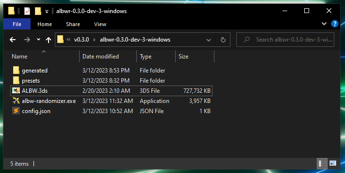
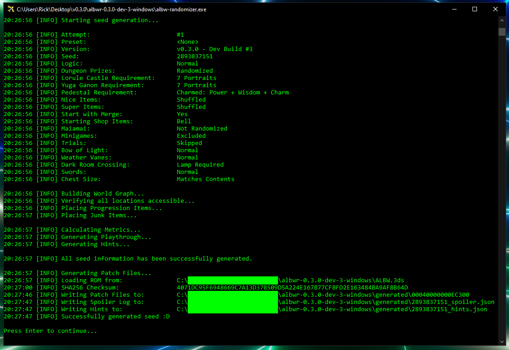
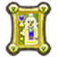
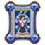
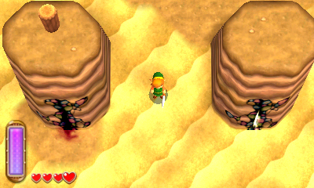
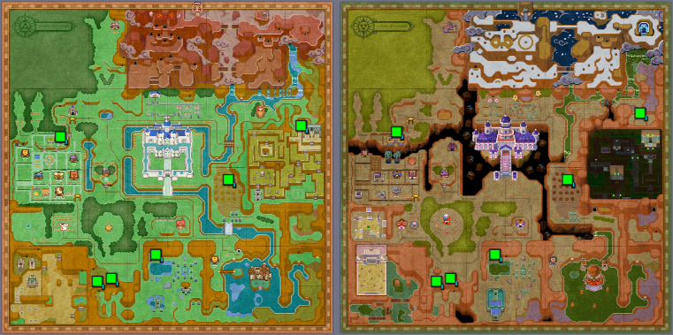
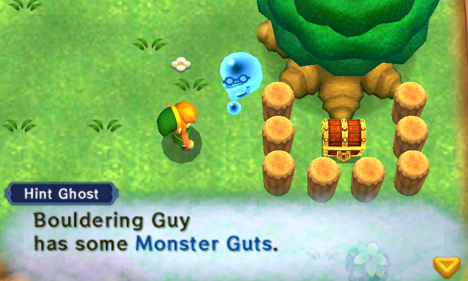
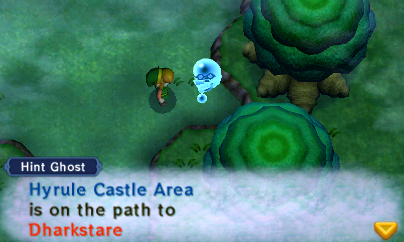
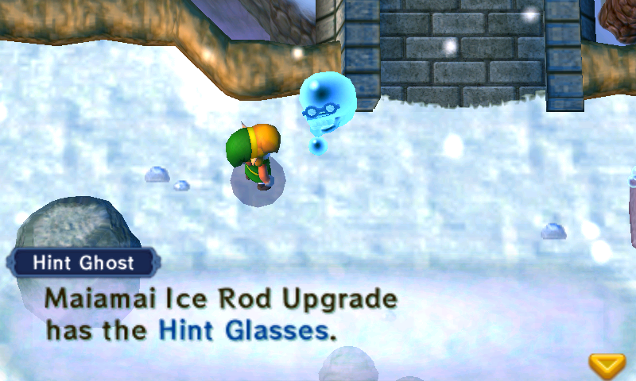

# The ALBW Randomizer
A randomizer for The Legend of Zelda: A Link Between Worlds.

<br />
<p align="center">
  
</p>

## Updates
<details open="open">
<summary>Version 0.4</summary>

- **Quake + Initially Closed Cracks**
  - Games will now start with most cracks closed, until players finds the new item that opens them: Quake.
  - The Hyrule Castle crack is the only crack open without Quake, and may be required to use if Quake is placed somewhere in Lorule.
    - Only the crack connected to Hyrule Castle will be open in Lorule.
    - If Cracksanity is enabled, the HC crack may lead to any crack in Lorule and therefore Quake may appear nearly anywhere in Lorule.
  - Players may optionally choose to start with Cracks already open, in which case Quake will be omitted from the item pool.
- **Cracksanity**
  - Four different shuffling modes:
    - Cross World Pairs
    - Any World Pairs
    - Mirrored Cross World Pairs
    - Mirrored Any World Pairs
  - Read the section for more details: [Cracksanity](#cracksanity)
- **Weather Vanes**
  - **Pair Shuffle**: Groups Weather Vanes into random pairs that unlock each other instead of themselves.
  - **Convenient**: Activates the Vanes that don't affect logic
  - Activate All Hyrule Weather Vanes
  - Activate All Lorule Weather Vanes
- **Skip Trials &rarr; Trial's Door Setting**
  - Select 1-4 LC Trials to randomly enable.
  - Set the door to open automatically
    - Inside Only: Opens only from inside the dungeon
    - Both Sides: Opens when approached from either direction. This can put LC into logic early via the dungeon's Crack.
- **Keysy**
  - Removes key doors in dungeons. This has the potential to make dungeons faster to complete, and also increases the odds of them having progression items.
  - Options:
    - Small Keysy
    - Big Keysy
    - All Keysy
- **Hint Ghost Changes**
  - Faster
  - Free

- **Gameplay Changes**
  - Information
    - Ravio will now reveal the locations of each Sage, as well as the `lc_requirement`.
    - Sahasrahla will now reveal the locations of all three Pendants, and can now be found in his house in Kakariko Village.
  - Charm
    - The Charm is no longer a dungeon prize, and Hyrule Castle will no longer house a random dungeon prize as a reward.
    - The Charm is still in the item pool, but does nothing. It is not progressive and is independent of the Pendant of Courage.
    - The vanilla Charm location will instead be a standard check, but requires the Impa Portrait to appear.
  - Changes to Reverse Sage Events (RSE):
    - This is no longer a setting and is now always enabled.
    - Dark Maze Guards will now disappear upon completion of the Dark Palace, instead of when Gulley is collected.
    - Thief Girl will now appear in her cave after she has been rescued from Thieves' Hideout, instead of when Osfala is collected.
    - The Shady Guy can now be bumped into at any time and does not require rescuing Oren.
    - For more details see: [Dungeon Prizes](#dungeon-prizes)
  - Ice Ruins:
    - A non-missable copy of the missable torch that opens the door on B3 has been added next to the East tongue statue.
      - This is a QoL change made to address a randomizer-only problem where the 3rd Small Key Door is opened earlier than the vanilla game intends.
      - This prevents players from needing to fall carefully to avoid the wind current.
      - This has no impact on logic.
  - Inside Hyrule Castle
    - No longer requires the Pendant of Courage (either) to enter, just Master Sword.
    - A courtesy green Warp will now appear after HC Yuga has been defeated, linking Zelda's Study with the Castle Gate.
  - Lorule Castle
    - The state of the Trials Door in Hilda's Study will now match its twin in the Lorule Castle dungeon.
    - If the player has not rescued all the Sages, the loading zone to Yuganon will instead drop the player at the Blacksmith's.
      - Once all Sages are rescued the path to the Lorule Blacksmith remains open via newly placed green Warp.
      - A courtesy green Warp will appear in the Lorule Blacksmith if it is entered from LC.
  - Thieves' Hideout Big Key Chest:
    - After defeating Stalblind the shield device used to reach the chest will activate automatically to prevent it from being missable.
    - Previously Thief Girl had been rigged to stick around to address this issue. That solution has been replaced by this one.
  - Treacherous Tower:
    - Reworked into a single check given by a single mode with a random selection of floors from all difficulties.
    - Can choose how many floors the tower has (2-66).
  - Eastern Palace
    - Map icons for "escape" chests will now appear before defeating the boss.
  - Rosso
    - Now appears properly inside his house when rescued, instead of the "Crooked Chest".
  - Rupees will now be named correctly in shops instead of being referred to as "Play Coins"
  - Fix the vanilla joystick bug that causes all inputs to be rotated 5 degrees counterclockwise.
- **Logic Changes**
  - All:
    - Dungeons now expect a certain amount of health to be available before entering logic.
  - Normal:
    - Knucklemaster, Zaganaga, and Yuga Ganon each now logically require the Master Sword to defeat
    - The Merge Chest on the right side of the Eastern Palace lobby now logically requires that dungeon's Compass.
    - The Hidden Chest on Ice Ruins 1F now logically requires that dungeon's Compass.
    - The Ice Rod or Bombs are now considered viable ways to activate the Eastern Palace switch(es) that activate the bridge to the Boss Door.
    - Misery Mire Ledge is now considered logically accessible with the Stamina Scroll as an alternative to the Sand Rod.
    - The Dark Palace right-side entrance chest no longer logically requires Lamp
    - House of Gales 1F Northwest chest no longer requires Merge or an escape item.
    - Ice Ruins logic updated to consider B3 crystal switch.
  - Glitched:
    - The new Sandcastling trick makes it possible to complete the Misery Mire Treasure dungeon without the Tornado Rod.
  - Hell:
    - The new Sand Hopping trick has been added. It allows completing the Hyrule portion of Desert Palace without Merge and reaching the 1F miniboss chest without the Titan's Mitt.
- **Hint System Changes**
  - Ravio's Shop is now considered its own region, separate from Central Hyrule.
  - The Graveyard Area now refers solely to the Lorule Graveyard.
  - Path Hints will now explicitly list their underlying Path Item in the Spoiler Log.
  - Hints should overall generate more quickly.
- **Spoiler Logs**
  - Can now be used as preset files to simplify seed sharing.
- Misc. Text Improvments:
  - Bee Guy
  - Hint Ghosts (sped up, less text if price is free)
  - Impa / Soldier
  - Mother Maiamai
  - Ravio
  - Rosso
  - Stylish Woman
  - Thief Girl
  - TR Turtles (Tallo, Jillo, and Sabro)
  - Witch
  - Woman

</details>

<details>
<summary>Version 0.3.1</summary>

- Always Hint pool expanded to include most checks that are locked behind Dungeon Prizes.
- Fix vanilla Letter in a Bottle location check to not disappear under certain conditions.
- Minor tweaks to some location names

</details>

<details>
<summary>Version 0.3.0</summary>

- <u>Dungeon Rewards Shuffled</u>
  - The 7 Sage Portraits & 4 Pendants are now randomly shuffled between the Hyrule and Lorule dungeons.
  - Maps will show a red X over uncompleted Portrait dungeons.
- <u>Hint System</u>
  - ZOOTR-style Path Hints are now generated with seeds!
  - See the [Hint System](#hint-system) section below for more details
- <u>Progressive Pendant of Courage</u>
  - The Pendant of Courage is now a Progressive Item that will appear in *two* dungeons.
  - The first one found will be the Charm, an item that does nothing by itself
  - The Charm's vanilla location in Hyrule Castle will contain a shuffled Sage Portrait or Pendant
- <u>New Major Settings</u>
  - Nice Mode
    - Shuffles a second progressive copy of every Ravio item into the pool.
    - Collect both to get that item's Nice version.
    - Note: For now, enabling this setting will remove the Mother Maiamai Cave from the game.
  - Reverse Sage Events
    - Causes checks and events related to a specific Sage to be tied to first rescuing that Sage.
  - No Progression Enemies
    - Removes enemies that are themselves progression, such as the small green Bomb enemies.
    - Increases the items required to get through several dungeons.
- <u>Hyrule Castle Complete Overhaul</u>
  - HC has been revamped and returned to its vanilla roots:
    - Pendant of Courage is required to enter the "Inside Hyrule Castle" dungeon
    - No longer a merge-free path to Lorule
  - Completing HC rewards players with early access to:
      - Lorule Castle via the Trials Door
        - Taking the crack to Hilda's Study will automatically mark the LC Trials as complete.
      - Throne Room (Final Boss Room)
        - Yuga Ganon will not spawn unless Portrait requirements are met
  - Option to disable the Hyrule Castle Dungeon entirely
- <u>Custom Portrait Requirements</u>
  - Lorule Castle: Choose how many Portraits are needed to enter the dungeon's front door.
- <u>Great Spin</u>
  - Now available! Great Spin has been added to the general item pool
  - Works with the Forgotten Sword (impossible in vanilla)
  - The bug related to losing Great Spin if obtained before Forgotten Sword has been resolved with an ASM patch
- <u>Chest Size Matches Contents option</u>
  - Turns all chests containing Progression into large chests, and all others into small chests.
  - Note: Some large chests have altered hitboxes to prevent negative gameplay interference.
- <u>Newly Randomized Checks</u>:
  - **Zelda's Throne in Hyrule Castle**
    - A Sage Portrait or Pendant will be here every seed
  - **Blacksmith Table**
    - This was the Captain's Sword package for delivery in vanilla, it'll be a chest on the table
  - **Cucco Dungeon**
    - ALttPR runners will know this as Cave 45. Our version has a freestanding Silver Rupee that will now be a random item.
  - **Ku's Domain Fight**
    - This is the Zora's Domain area, but in Lorule. For technical reasons, this will be a chest.
  - **Woman**
    - Rescue the Maiamai on her roof in Kakariko and then talk to her to get a reward.
    - (Yes... that's really her name.)
- <u>Bottle Trade Item Changes</u>
  - Only one of the bottle trade items (Letter or Premium Milk) will now be randomized.
    - If you get the Letter in a Bottle, bring it to the Milk Bar to receive Premium Milk.
    - If you get Premium Milk, you can skip the bar and go directly to the Bouldering Guy.
  - Bouldering Guy will empty your bottle (making it usable) AND give you a random item.
  - All bottled items should now display correctly in the player inventory.
- <u>Great Rupee Fairy</u>
  - Automatically throw 3000 rupees as one action!
- <u>Item Hash</u>
  - On the File Select Screen and in your spoiler log you will now find a 5 character Item Hash that you can compare with other players to be confident you are playing with the same Seed and Settings.
- <u>Several cutscenes shortened/reworked</u>
  - Triforce of Courage cutscene is notably skipped.
- <u>Logic Adjustments</u>:
  - Irene + Shady Guy events return
    - Their cutscenes are not instant, but they are greatly shortened
  - Rosso's House starts locked again
    - Needs Pendant of Courage to unlock (or Rosso if playing with the new RSE Setting)
- <u>Night Mode Improved</u>:
  - The effect no longer disappears when entering a Crack and will last indefinitely.
- <u>Spoiler Log</u>:
  - New Playthrough section
      - Shows Sphere-by-Sphere logical path through seed.
      - Note: For readability, minor progression (Rupees, Maiamais, Health, Events) items are omitted.
  - Formatting improvements, should be easier to read.
- <u>Fixes</u>:
  - Pedestal requirements are properly enforced.
  - Chests containing the Compass in vanilla will now show up on their respective dungeon maps.
  - Softlock prevention added to Gales to prevent players from getting locked into the 1F miniboss.
  - Swamp Palace anti-softlock measures have been reversed.
  - Misc. textbox changes and fixes

*All changes from the unofficially released v0.1.3 have been folded into this update.*
</details>

<details>
<summary>Version 0.1.3</summary>

- Maiamai Madness
  - This shuffles all Maiamai locations into the pool, adding 100 new checks.
  - Thank you to Gamestabled for the ASM contributions that made this possible!
- The Filler Algorithm has been adjusted to help un-bias early game locations.
  - Big Keys, Small Keys, and Compasses are now placed before all other forms of progression.
  - As a bonus, seed generation is now much more likely to be successful on the first try and is therefore faster.
- Glitched Logic modes will no longer pre-open the Maiamai Cave
  - This is to hopefully prevent players from getting a Nice item that's not Nice Bombs first
- Pre-activated Weather Vanes Option (Experimental)
  - This allows skipping many overworld item requirements and also for all regions of Lorule to be explored without Merge.
- Logic Adjustments:
  - Hard Logic no longer requires players to get Nice Bombs.
    - This was potentially needed to climb Hyrule Castle, but going forward only Glitched logics will require players to get Nice Bombs.
  - Lost Woods clip to get Big Rock Chest has been moved to Glitched Hell Logic.
  - Thieves' Hideout B1 with just Bombs has been moved to Glitched Hell logic.
  - Thieves' Hideout B1 with Boomerang + Boots added to Glitched Basic, or just Boomerang to Glitched Advanced.


</details>
<details>
<summary>Version 0.1.2</summary>

- Added back the non-required Lamp option: `lampless`. If enabled during seed generation, the logic may require the player to cross dark rooms without a light source.
  - A slightly more verbose description was added this time to hopefully prevent new players from enabling this by mistake.
- **LOGIC FIXES**:
  - House of Gales miniboss can't be defeated by a fire weapon (all logic)
  - Lamp and Net weren't being considered as weapons in a few places (Hard Logic)
  - Hookshot Treasure Dungeon can be reached without merge, but not completed without merge (Glitched Advanced)
  - Thieves' Hideout mergeless glitched logic was... who wrote this? Me? Oh. Well it's fixed now. (Glitched Basic/Advanced)
- **FIXED:** Bouldering Guy
  - The Bouldering Guy will now stay on his ledge on Death Mountain if you have collected the Letter in a Bottle but not yet turned it in.
- **FIXED:** The `bow_of_light_in_castle` option now fully respects the exclusion list.
  - There was previously special handling to make sure Bow of Light wouldn't land on Zelda if she was manually excluded, but it failed to consider any other check in Lorule Castle players might have excluded. This has been corrected, so if you exclude e.g. the Eyeball Chest while using this setting it's now guaranteed to not have Bow of Light (or any progression).

</details>
<details>
<summary>Version 0.1.1</summary>

- **FIXED:** Desert Palace Key Logic
- **FIXED:** Normal Logic Swordless Mode bug

</details>
<details>
<summary>Version 0.1.0</summary>

- New Filler Algorithm:
  - This has been a long time coming :)
  - The filler has been completely rewritten using an **Assumed Fill** algorithm. The old algorithm had a tendency to front-load progression items in the Overworld (often just Hyrule's), and very rarely put anything noteworthy in dungeons. This new algorithm fixes those problems and produces interesting "logic chains" with a much higher frequency.
  - The vanilla Bow of Light issue has been solved once and for all! The new filler has no biases towards Zelda, and excluding her prevents her from having any progression at all.


- Hyrule Castle + "Yuga Seeds"
  - After a lot of remodelling, Hyrule Castle is open once again!
  - Defeating Yuga 2 awards a unique type of progression: Access to Lorule **without Ravio's Bracelet**. This makes it possible for the Bracelet or an item leading to Bracelet to spawn in the main area of Lorule, including the early portions of Thieves' Hideout and Swamp Palace.
  - To accomplish this, the north exit from the Yuga 2 boss fight has been redirected to drop Link into the Lorule Blacksmith. This door will remain open if the player needs to use it multiple times.
  - Note 1: Climbing Hyrule Castle logically requires the Bow or the Ice Rod to kill the Red Spear soldier mergeless on 3F. It can also be done with Nice Bombs (Hard Logic, see below), or the Nice Tornado Rod (not in any logic).
  - Note 2: If you need to return to Hyrule after reaching Lorule in this way, you need to death warp to return to Link's House. We're exploring more *elegant* ways to do this in the future, but this is what we have for now.
  - Note 3: Swamp Palace was really not designed for the player to not have merge, with three rooms capable of softlocking the player if they unwittingly entered mergeless. To combat this, 2 doors that normally shut behind the player have been removed. Additionally, the crystal switch in the B1 north room that would normally divert the river has been removed, preventing a softlock that could otherwise occur (the switch was never needed, players could always bypass the river by merging).


- New Logic Modes
  - The logic has been expanded into six (6) different modes. Hopefully there's something for everyone.
    - <u>Normal</u>: Standard gameplay, no tricky item use or glitches. If unsure, choose this.
    - <u>Hard</u>: Adds tricks that aren't technically glitches, lamp + net considered as weapons. No glitches.
    - <u>Glitched (Basic)</u>: Includes the above plus "basic", easy-to-learn glitches.
    - <u>Glitched (Advanced)</u>: Includes the above plus "advanced" glitches that may be a challenge to master.
    - <u>Glitched (Hell)</u>: Includes every known RTA-viable glitch, including the insane ones. DO NOT CHOOSE THIS.
    - <u>No Logic</u>: Items are placed with no logic at all. Seeds may not be completable.

  - A full breakdown of the new logic modes is located further down this page.


- Sanctuary, Rewired
  - The doors to the Sanctuary church are now closed at game start. They will open upon completing the Sanctuary dungeon, specifically when the left-side switch is pulled at the dungeon's end.
  - This change effectively locks the Lorule Graveyard behind completing the Sanctuary, meaning players have a reason to collect the key, fight the miniboss, and actually finish the dungeon now.

  
- Ravio's Bracelet Changes
  - The second Bracelet has returned to the item pool, meaning you must find both before you can Merge.
  - The `start_with_bracelet` option has been deprecated. The option mostly existed to cover for the old filler algorithm's shortcomings, but now that those have been addressed the option is being retired.


- Pendant of Courage Changes
  - Rosso's House has been unlocked from game start and the check for smashing his pet rocks is logically available anytime after you've obtained the Power Glove.
  - The Irene check has been removed entirely. This check with its multiple invisible triggers caused a lot of confusion for players, so for now we've decided to remove it.
    - Don't worry, you'll still be able to see Irene on her broom after you've rescued her portrait.
  - This leaves the Haunted Grove Tree Stump as *the* Green Pendant-locked check.


- Swordless Mode Changes
  - The Hyrule Castle Barrier will now be removed when playing on Swordless Mode, granting access to 2 otherwise inaccessible chests and the Hyrule Castle dungeon.
  - Yuga 2 can still be fought in Swordless Mode to access Lorule without Bracelet, but note that he cannot be harmed with the Bow alone.


- New Option: `assured_weapon`
  - Guarantees at least one weapon will be placed in Ravio's Shop
    - Items include: Bow, Bombs, Fire Rod, Ice Rod, Hammer, Sword (if not playing Swordless), or Lamp/Net (if playing on Hard Logic or higher)


- New Option: `bow_of_light_in_castle`
  - Guarantees Bow of Light will spawn on one of the 15 checks inside Lorule Castle.
    - Note: This includes Zelda, unless you manually exclude her.


- Change to *`_in_shop` settings:
  - When the Bell, Pouch, Boots, or an assured weapon is placed in Ravio's Shop, it will now be placed on a random slot (but never the Sand Rod Slot).


- Letter in a Bottle pickup text has been removed


- Great Rupee Fairy will now logically guarantee (at least) 3000 Rupees are available between placed Purples, Silvers, and Golds.
  - This change is intended to prevent players from having to grind large amounts of rupees in the early game.


- The randomizer will no longer generate a `Standard.toml` preset that overwrites itself. Instead, an ~~`Example.toml`~~ `Example.json` preset is provided to demonstrate the correct format, and you may modify or delete it ~~at your own peril.~~


- **FIXED:** Vanilla Bow of Light
  - The new filler is not biased towards giving Zelda the Bow of Light.
  - Excluding Zelda is now *guaranteed* to prevent a vanilla Bow of Light placement.

  
- **FIXED:** Smooth Gem
  - The issue preventing players from giving Oren the Smooth Gem has been
    - (•\_•)
    - ( •\_•)>⌐■-■
    - _smoothed out_
    - (⌐■_■)
    - _YEAAAAHHHHHHHHHHH_
 

- **FIXED:** Skull Woods Softlock
  - It was technically possible to get softlocked in the hallway outside the Skull Woods boss if the player reached it without the Lamp, Fire Rod, Bombs, a Scoot Fruit, or the dungeon's Boss Key. There are no reports of this happening as it would require navigating Skull Woods completely in the dark while being unlucky enough to have none of those items, but it was technically possible. The fix prevents the door closing behind the player when they enter the hallway, allowing them a means of escape.


- **FIXED:** Duplicate/Wrong Enemies in Hyrule Field
  - The enemies present in Hyrule Field should now be those typically present in the vanilla game after beating Eastern Palace and opening the cracks to Lorule. The seemingly random duplicates in certain areas have been removed.


- **FIXED:** Kakariko now has the correct number of NPCs and Cuccos.


- **ALTERED:** The rock used to perform Trial's Skip in Lorule Castle will now respawn after leaving and re-entering the room. This is to keep Trial's Skip doable in the event the rock is accidentally destroyed.

</details>
<details>
<summary>Version 0.0.4</summary>

  - **FIX:** Prevent players missing the Big Key Chest in Thieves' Hideout.
    - Thief Girl will now remain in the dungeon even after completing it.
  - `skip_trials` option added. Removes the Trials Door in Lorule Castle if enabled.
  - `boots_in_shop` promoted to a UI option instead of requiring a preset to use.
  - Glitched logic now considers using the Ice Rod to reach the Eastern Palace Boss door.
  - Long Crack animation from Zelda's Study has been shortened.
  - The following cutscenes have been removed:
    - Zelda in the Sacred Realm
    - Thief Girl Cave
    - Kakariko Girl/Papa (if you didn't get anything from Ravio)
    - Blacksmith's Wife
  - The randomizer now calculates your ROM's SHA256 checksum for troubleshooting purposes.
  - Bye Seres
  - _True_ Double Ravio.
</details>
<details>
<summary>Version 0.0.3</summary>

- Highlights:
  - Super Lamp and Super Net inclusion option added. These are progressive updates to the base Lamp and Net, meaning there will be 2 of each in the item pool if the option is enabled.
  - Maiamai Cave is open by default, bombs are no longer necessary.
  - The Curtain bug in Zelda's Study is fixed.
  - The Weather Vanes by Link's House and the Vacant House are pre-activated.
  - Many small cutscenes have been removed, most notably in the Dark Maze. Sorry Hilda Hey fans.

- Additional Changes:
  - The Inside Hyrule Castle dungeon door is now sealed shut. Remember, there is no need to enter this dungeon in this version of the randomizer.
  - A boulder was removed from the Donkey Cave to fix a potential vanilla softlock
  - Minor UI tweaks
</details>
<details>
<summary>Version 0.0.2</summary>

- Highlights:
  - Introduction of Swordless Mode Option. I regret this already :^)
  - New options to place Bell, Pouch, and/or Pegasus Boots in Ravio's Shop
  - Expanded Glitched Logic to include more tricks in all dungeons
  - UI updates should provide more useful feedback when seeds fail to generate

- Additional Changes:
  - Smooth Gem is now locked to its original location in Kakariko (temporary fix for related bug)
  - Fix logic bug that could place Bracelet on Fire Cave Pillar in a Glitched No Bracelet seed
  - Removed `unsafe_key_logic` option. Please remove this from your presets.
</details>
<details>
<summary>Version 0.0.1</summary>

- Highlights:
  - Cracks to Lorule are open from game start
  - Start with Ravio's Bracelet option
  - Glitched Logic option
  - Ravio's Shop is fully open from game start
  - Maiamai are available to be collected from game start (still need bombs to turn them in)
  - Improved UI and auto-retry mechanism for seed generation


- Additional Changes:
  - All Hilda Text cutscenes have been skipped (except Dark Maze)
  - Skip Sahasrahla outside Link's House
  - Skip Ravio's Sign Trigger cutscene
  - Shady Guy and Merchant's right-side item are available from game start
  - Hyrule Hotfoot open from game start
  - Monster Guts/Horn/Tail initial pickup scenes skipped
  - Energy Potion initial pickup scene skipped
  - Fix Sahasrahla Softlock
  - Maiamai Map available by default
  - Map Swap icon available by default
  - Master Ore UI element present by default
  - Remove Standard Mode option
  - Experimental option "Night Mode" changes Hyrule's lighting until you visit Lorule. There are some performance issues on console, so not advised for races.
</details>

## Setup

- Download: [https://github.com/rickfay/z17-randomizer/releases/tag/v0.3.0-release](https://github.com/rickfay/z17-randomizer/releases/tag/v0.3.0-release)

1. Unzip the download to your directory of choice.
2. ROM Requirements:
   - Must be the **North American** version of ALBW
   - Must be a `.3ds` file
   - Must be **decrypted**
     - You can use Godmode9 to decrypt your ROM, if necessary.
3. How to dump and/or decrypt a legal ROM from your owned copy of game:
   - Instructions are available here: https://citra-emu.org/wiki/dumping-game-cartidges/
   - If you need to convert your ROM from `.cia` to `.3DS` you can use this tool: https://github.com/davFaithid/CIA-to-3DS-Rom-Converter/releases/tag/1.0
4. Move your A Link Between Worlds ROM into the same folder. Name it: `ALBW.3ds`
   - Be careful not to accidentally give it two extensions, i.e. `ALBW.3ds.3ds`. This is an easy mistake to make if you have Windows set to hide known file extensions.
   - You can modify the `config.json` file if you'd like to name your ROM something else or put it in a different location.




## Running the Randomizer

First, make sure your system's language is set to **ENGLISH**.
- Using any other language will cause your seed to patch incorrectly.
- Support for other language options is planned, but not supported at this time.

There are two ways you can run ALBWR:

1. Double click `albw-randomizer.exe` (or `albw-randomizer` on Linux) to start the randomizer with basic settings. The randomizer will provide a simple interface for setting game options, after which it will attempt to generate a completable seed.
   - The randomizer may make multiple attempts to generate a completable seed. This is normal, and will happen automatically.
     - Seed Generation usually completes in 1-3 attempts, slightly higher if using some form of Entrance Randomization.

2. Use a command line interface. If you take this approach you may also specify a preset and/or seed to use for seed generation.
   - Using a preset will give you some additional options and allow you to manually configure excluded checks.
     - See the example `presets/Example.json` for more information.
   - Examples:
     - Windows:
       - `$ ./albw-randomizer.exe --preset Example`
       - `$ ./albw-randomizer.exe --seed 2893837151`
     - Linux:
       - `$ ./albw-randomizer --preset Example`
       - `$ ./albw-randomizer --seed 2893837151`
   - Additional parameters:
     - Add `--no-patch` to skip generating the patch files
     - Add `--no-spoiler` to skip generating the spoiler log

Later versions of the randomizer may look slightly different, but you should see something like the following when the seed is generated successfully:



## Installing Seeds

After you've generated your seed in the above section, you'll need to install it in order to actually play the randomizer.

The randomizer will generate a folder called `00040000000EC300`. This folder is the patch you need to install to play your seed.

For 3DS hardware:
- Copy `00040000000EC300` to `/luma/titles/` on your SD card.
- Ensure that `Enable game patching` is selected in Luma's config (this can be opened by holding `Select` when powering on the console).

For Citra (emulator):
- Copy `00040000000EC300` to `<Citra folder>/load/mods/`.
  - You may need to create these folders.
  - You can find the Citra folder by selecting `File > Open Citra folder...` in Citra.

## Uninstalling Seeds

Uninstalling seeds is essentially just the reverse of the installation process.

For 3DS hardware:

- Either:
  - Hold `Select` when powering on the console and deselect `Enable game patching`, OR
  - Remove the patch from `/luma/titles/` on your SD card.

For Citra (emulator):
  - Remove the patch from `<Citra folder>/load/mods/`.
    - You can find the Citra folder by selecting `File > Open Citra folder...` in Citra.

## Game Options

`logic_mode`
- Determines the Logic to use when generating the seed.
- Available Logic Modes are:

| Setting       | Description                                                                                  |
|---------------|----------------------------------------------------------------------------------------------|
| `Normal`      | Standard gameplay, no tricky item use or glitches. If unsure, choose this.                   |
| `Hard`        | Adds tricks that aren't technically glitches. Lamp + Net considered as weapons. No glitches. |
| `Glitched`    | Includes the above plus a selection of easy-to-learn glitches.                               |
| `AdvGlitched` | Includes the above plus "advanced" glitches that may be a challenge to master.               |
| `Hell`        | Includes every known RTA-viable glitch, including the insane ones. Don't choose this.        |
| `NoLogic`     | Items are placed with no logic at all. Seeds are likely to not be completable.               |

`lc_requirement`
- This setting determines how many Portraits are needed to:
  - Enter Lorule Castle's front door
  - Spawn the Bow of Light Hint Ghost
  - Fight Yuganon

`ped_requirement`
- Choose which Pendants are required to reach the Master Sword Pedestal:
- Available options are:

| Setting    | Description                                                           |
|------------|-----------------------------------------------------------------------|
| `Vanilla`  | Only the Pendants of Power and Wisdom are required (vanilla behavior) |
| `Standard` | All three Pendants are required                                       |

`dungeon_prize_shuffle`
- This shuffles all Sage Portraits and Pendants amongst themselves as the prizes for completing dungeons.

`cracks`
- Choose the intial state of the Cracks between Hyrule and Lorule

| Setting | Description                                                                                      |
|---------|--------------------------------------------------------------------------------------------------|
| Closed  | All Cracks, except the one in Hyrule Castle, are closed and require the Quake item to be opened. |
| Open    | Begin the game with all Cracks open. The Quake item is not included in the item pool.            |

`cracksanity`
- Randomizes the pairings between the Cracks that (normally) go between Hyrule and Lorule.
  - Note: For technical reasons, The Desert Palace Crack is not yet randomized.

| Setting                    | Description                                                                                 |
|----------------------------|---------------------------------------------------------------------------------------------|
| Off                        | Cracks are not shuffled.                                                                    |
| Cross World Pairs          | Cracks are shuffled, but remain in Hyrule/Lorule pairs.                                     |
| Any World Pairs            | Cracks are shuffled freely, and can lead to the same or opposite world.                     |
| Mirrored Cross World Pairs | Same as Cross World Pairs, but each pair's vanilla counterparts will be in a matching pair. |
| Mirrored Any World Pairs   | Same as Any World Pairs, but each pair's vanilla counterparts will be in a matching pair.   |

`keysy`
- Removes locked doors from dungeons, eliminating the need for collecting keys.

| Setting     | Description                                                  |
|-------------|--------------------------------------------------------------|
| Off         | No effect.                                                   |
| Small Keysy | Small Key doors are removed from all dungeons.               |
| Big Keysy   | Huge Doors are removed from all dungeons.                    |
| All Keysy   | Both Small Key and Huge Doors are removed from all dungeons. |

`trials_door`
- Configures the Lorule Castle Trial's Door.

| Settings            | Description                                                                                                                       |
|---------------------|-----------------------------------------------------------------------------------------------------------------------------------|
| OpenFromInsideOnly  | The Trials Door will open by itself automatically, from inside LC only.                                                           |
| OpenFromBothSides   | The Trials Door will open by itself automatically, from inside LC or in Hilda's Study. This option may require entering LC early. |
| OneTrialRequired    | Turns on 1 random trial.                                                                                                          |
| TwoTrialsRequired   | Turns on 2 random trials.                                                                                                         |
| ThreeTrialsRequired | Turns on 3 random trials.                                                                                                         |
| AllTrialsRequired   | Turns on all trials.                                                                                                              |

`weather_vanes`
- Choose Weather Vanes behavior. Logic may require using them to progress.

| Settings   | Description                                                                                |
|------------|--------------------------------------------------------------------------------------------|
| Standard   | Only the standard, complimentary Weather Vanes are active at game start.                   |
| Shuffled   | Shuffles the Weather Vanes in pairs, so each activates a warp to a random Weather Vane.    |
| Convenient | Activate all the Weather Vanes that don't affect logic, but do make getting around easier. |
| Hyrule     | Activate the 9 Hyrule Weather Vanes at game start.                                         |
| Lorule     | Activate the 13 Lorule Weather Vanes at game start.                                        |
| All        | Activate all 22 Weather Vanes at game start.                                               |

`maiamai_limit`
- The MAXIMUM number of Maiamai (0-100) the seed may require you to collect, assuming you don't waste any on junk.
  - Defaults to 50, meaning Mother Maiamai may have up to 5 Progression Items in her shop.
  - Only by setting this setting to 100 can the 100 Maiamai check ever be a Progression Item.

`maiamai_madness`
- Shuffles Maiamai into the pool, adding 100 more locations

`nice_items`
- Choose how to handle the second progressive copy of each Ravio Item, normally available as upgrades from Mother Maiamai.
  - Note: Mother Maiamai's items always require the base Ravio Item in addition to 10 Maiamai, each, regardless of which setting is chosen.

| Setting  | Description                                                                                                 |
|----------|-------------------------------------------------------------------------------------------------------------|
| Vanilla  | Nice Items are obtained as upgrades from Mother Maiamai as in the vanilla game.                             |
| Shuffled | Two progressive copies of each Ravio item are freely shuffled, and Mother Maiamai's rewards are randomized. |
| Off      | Remove and replaces the Nice Items with junk, and Mother Maiamai's rewards are randomized.                  |

`super_items`
- This shuffles a second progressive copy of the Lamp and Net into the general item pool.
  - Obtaining both rewards the Super Lamp and Super Net, respectively.

`bow_of_light_in_castle`
- Limits the Bow of Light's placement to somewhere in Lorule Castle (including possibly Zelda).

`minigames_excluded`
- Excludes Cucco Rush, Hyrule Hotfoot, Treacherous Tower, Octoball Derby, and both Rupee Rush minigames from having progression.
  - If `maiamai_madness` is enabled, the two Maiamai inside the two Rupee Rush minigames will also be excluded.

`no_progression_enemies`
- Removes Enemies from dungeons that are themselves Progression (e.g.: Bawbs, the bomb enemy).
- Logic will be adjusted to require the player's items instead.

`purple_potion_bottles`
- Fills all Empty Bottles with a free Purple Potion.
  - Purple Potions deal 4x your current Sword damage to all loaded enemies!

`skip_big_bomb_flower`
- Skips the Big Bomb Flower by removing the 5 Big Rocks in Lorule Field.
- This setting does not affect the Vacant House or the Lorule Castle Bomb Trial.

`treacherous_tower_floors`
- The number (any integer between 2 and 66) of floors the Treacherous Tower minigame will have.
  - The first floor will always be one of the 3 starting floors (from Beginner, Intermediate, or Advanced).
  - The final floor will always be the (Tower of Hera) Moldorm fight.
  - The minigame will always reward 1000 rupees, regardless of the number of floors chosen.

`swordless_mode`
- Removes *ALL* Swords from the game.
- [The Bug Net becomes a required item to play Dead Man's Volley against Yuga Ganon.](https://www.twitch.tv/videos/1265170513)
- <u>Note</u>: Incompatible with the `sword_in_shop` setting.

`dark_rooms_lampless`
- If enabled the logic may expect players to cross Dark Rooms without the Lamp.
- Not for beginners and those who like being able to see things.

`lamp_and_net_as_weapons`
- Treats the red base Lamp and Net as logical weapons (recommended only for advanced players)

`start_with_merge`
- Start with the ability to Merge into walls, without Ravio's Bracelet.

`start_with_pouch`
- Start with the Pouch and a usable X Button.

`bell_in_shop`
- If enabled, guarantees the Bell will be placed in Ravio's Shop.

`sword_in_shop`
- If enabled, guarantees the Pegasus Boots will be placed in Ravio's Shop.
- <u>Note</u>: Incompatible with `assured_weapon` or `swordless_mode` settings.

`boots_in_shop`
- If enabled, guarantees the Pegasus Boots will be placed in Ravio's Shop.
- <u>Note</u>: Incompatible with `assured_weapon` setting.

`assured_weapon`
- If enabled, guarantees that a weapon will be placed in Ravio's Shop
- <u>Note</u>: Incompatible with `sword_in_shop` or `boots_in_shop` settings.
- Potential weapons include:
  - Sword (if not playing Swordless)
  - Bow
  - Hammer
  - Fire Rod
  - Ice Rod
  - Bombs
  - Pegasus Boots
  - Lamp/Net (if `lamp_and_net_as_weapons` is enabled)

`chest_size_matches_contents`
- All chests containing progression or unique items will become large, and others will be made small.
- <u>Note</u>: Some large chests will have a reduced hitbox to prevent negative gameplay interference.

`night_mode`
- Enables certain shaders on the overworld that make it look like nighttime.
  - Warning: Can change the visual cues for certain glitches and tricks.

### Dungeon Prizes

| Name               | Prize                                           | Effect / Unlocks                                                                                                                    |
|--------------------|-------------------------------------------------|-------------------------------------------------------------------------------------------------------------------------------------|
| Gulley Portrait    |                  |                                                                                                                                     |
| Oren Portrait      |                      | Makes Queen Oren return to Zora's Domain, allowing the player to collect her check by giving her the Smooth Gem.                    | 
| Seres Portrait     |                    |                                                                                                                                     | 
| Osfala Portrait    |                  | Returns the item he rented to Ravio's Shop, allowing the player to buy it from him.                                                 | 
| Impa Portrait      |                      | Makes the check in the Hyrule Castle Throne Room available.                                                                         | 
| Irene Portrait     |                    | Makes Irene available to be bumped into at one of four locations.                                                                   | 
| Rosso Portrait     |                    | Causes Rosso to return home. He has two checks himself, and he also opens his front door allowing access to the Crack in his house. | 
| Pendant of Power   |      |                                                                                                                                     |
| Pendant of Wisdom  |    |                                                                                                                                     |
| Pendant of Courage |  | Makes a single check appear on the Wildlife Clearing Stump.                                                                         |


## Quake


Obtaining the Quake item activates the second quake event in the vanilla game, which opens the cracks and adjusts some overworld enemy spawns. It'll also affect some NPCs' dialog.

This item was created for the randomizer to give an experience closer to the vanilla game where the cracks are not open early-on, meaning Lorule is unreachable even once the player has the ability to Merge.

Importantly, the Hyrule Castle Crack is the only one that will be open without Quake. Because of this, Hyrule Castle has a much more substantial role to play in the randomizer as a sometimes necessary dungeon to complete if Quake (or something that leads to it) happens to be in Lorule. Or simply for its crack, when playing with Cracksanity.

The item is called "Quake" because that is how several NPCs refer to the story event in dialog. Interestingly, they always refer to it as "quake", but never "earthquake".

The sprite commonly found on trackers is borrowed from the item of the same name from this game's predecessor, A Link to the Past.

## Cracksanity


There are 56 Cracks (aka "fissures") in the game formed into pairs that connect areas of Hyrule with Lorule.

We shuffle them!

| Setting                    | Description                                                                  |
|----------------------------|------------------------------------------------------------------------------|
| Cross World Pairs          | All Cracks will connect Hyrule + Lorule                                      |
| Any World Pairs            | Any Crack can lead to any other Crack.                                       |
| Mirrored Cross World Pairs | Same as Cross World Pairs, but each pair's counterparts will also be paired. |
| Mirrored Any World Pairs   | Same as Any World Pairs, but each pair's counterparts will also be paired.   |


### Crack Appearance

The destination of a Crack determines its appearance.



- White light &rarr; Hyrule
- Black fog &rarr; Lorule

### Crack Pools

Most Cracks in the game are "up" cracks, like the one in front of Link's House.

However, there are 6 pairs of "down" cracks as well, that reside on the backs pillars, buildings, etc.
For technical reasons, these cracks can only be shuffled amongst themselves.


<div style="text-align: center; font-style: italic; margin-bottom: 75px;">Down Crack Locations</div>

| Hyrule                | Lorule            | Lorule Area    |
|-----------------------|-------------------|----------------|
| Sahasrahla's House    | n-Shaped House    | Skull Woods    |
| Eastern Ruins Pillar  | Dark Ruins Pillar | Dark Ruins     |
| Zora's Domain         | Ku's Domain       | Dark Ruins     |
| Paradox Left          | Paradox Left      | Central Lorule |
| Paradox Right         | Paradox Right     | Central Lorule |
| Southern Ruins Pillar | Swamp Pillar      | Central Lorule |

### Blocked Cracks

There are 4 Cracks that are blocked by bombable walls:
  - Eastern Ruins Southeast Crack
  - Dark Ruins Southeast Crack
  - Desert North Crack
  - Graveyard Ledge (Lorule)

If you enter a crack paired with one of these cracks, the blockage will automatically be cleared as though you had blown it up.

Because of this, the logic only requires bombs to enter the blocked side of cracks.

### Cracks of Interest

#### Hyrule Castle Crack
- This crack and its pair are the only cracks open without **Quake**.
- If Cracksanity is off, **Quake** may appear in Central Lorule and players will need to use this crack to get there.
- When Cracksanity is on, the Hyrule Castle crack will lead to a random crack in Lorule, and thus one random region of Lorule will become accessible. In this way, **Quake** has the potential to appear in any region of Lorule.
  - For technical reasons, the Hyrule Castle Crack will *only* go to Lorule. It cannot be paired with another Hyrule Crack.

#### Lorule Castle Crack

AKA the Final Boss crack, the Yuganon Crack, etc.
- This crack is treated as access to the Central Lorule area, because if players haven't yet met the LC Requirement the loading zone to the Throne Room will instead send them to the Lorule Blacksmith.
  - A courtesy return warp will appear in the Lorule Blacksmith if this path is used.
  - Once the LC Requirement has been met this path will remain open with a new warp placed near the doorway.
- This crack can allow access into Lorule Castle 3F if `trials_door` is set to the `OpenFromBothSides` setting.
- While not necessary to complete the game, this crack allows skipping the entirety of the Lorule Castle dungeon and is simply a faster way to the final boss once all requirements are met.


#### Southwest Desert Crack

Logic may require players to use the **Stamina Scroll** to have enough Energy to merge from the top part of the East wall going South to reach the crack in the Southwest corner.

Other than using the crack itself (or glitches), this is actually the _only_ way to reach this Crack.

#### Desert Palace + Zaganaga Cracks

These two cracks are forcibly kept paired vanilla so that Desert Palace does not lose its Boss and dungeon prize. For now...

#### Rosso's House Crack

- This crack is locked inside Rosso's House, meaning rescuing Rosso is a requirement to access it.
- If you enter Rosso's House using this crack before rescuing Rosso, it will be empty, and if you leave via the door it will lock behind you.

## Hint System

Hints were introduced in Version 0.3 and have been refined slightly in Version 0.4.

> Hints are still a relatively new feature, and are being fine-tuned based on player feedback.

### About Hint Ghosts

Hints in this randomizer are given by Hint Ghosts.



In the vanilla game, these specters would trade Link a small hint in exchange for a Play Coin, the 3DS system currency gained by walking around with your console. The ghosts could only be seen if the player uses the Hint Glasses.

In the randomizer, the ghosts can be seen even without the Hint Glasses, and (starting in v0.4) give their hints freely.

Due to the overwhelming number of Hint Ghosts in the game (a whopping 193!!), **only the 58 overworld Hint Ghosts will give out these hints**, and the dungeon Hint Ghosts have been removed.

### Path Hints



Path Hints in ALBWR are similar to Path Hints in recent seasons of ZOOTR.

They can be thought of like "Way of the Hero" Hints from other Zelda randomizers, except instead of hinting a location with an item needed to beat the seed they instead hint a location with a [Path Item](#path-items) needed to reach a particular goal.

Path Hints take the following form:

```
[AREA] is on the path to [GOAL]
```

`[GOAL]`
- Presently, goals will always be the Bosses of dungeons housing a Sage Portrait.

`[AREA]`
- Refers to the specific region where the hinted `Path Item` can be found.
- To keep locations from being arbitrarily defined, the Maiamai Map boundaries are used for all region boundaries.
  - <u>Special Cases</u>:
    - `Ravio's Shop` is considered its own region, separate from Central Hyrule.
    - Hyrule Hotfoot is considered part of the `Lost Woods Area`, as it is there that the reward is given out.
    - Irene can appear in multiple regions, and so she has a unique region called `Irene the Witch`.

#### Area Names
<div style="text-align: center; display: flex;">
  
  
</div>

#### Path Items

A `Path Item` is any item that, according to the logic used to generate the seed, is required to reach a given Goal.

Path Items are not guaranteed to be the traditional items needed to complete a dungeon, so long as they are in some way logically required.
  - E.g. The Sand Rod can be Path to Moldorm if the Hammer is in Desert Palace.
    - This is because the Sand Rod, while not required to beat Moldorm, is necessary to retrieve the Hammer, which is.

An item cannot be Path if an in-logic alternative exists. Put another way, an item with a 2nd copy must "lock" that copy in order for it to be Path, as if they don't then that copy could be used to reach the Goal instead of that would-be Path Item.
  - E.g. If Ravio's Shop contains two Lamps, neither of them can be Path to Knucklemaster as neither Lamp locks the other.

> Two Path Hints cannot refer to the same underlying Path Item. They may refer to two items in the same logical chain, but each hint will uniquely refer to a specific item.

> Locations hinted by an [Always Hint](#always-hints) will never contain a Path Item, as they are already hinted.

The following will NEVER be Path Items:
- Ravio's Bracelet
- Keys
- Sage Portraits
- Pendants
- "Progression Events", e.g. bumping into Shady Guy

#### Extra Path Hints

The randomizer will attempt to generate a Path Hint for every Boss guarding a Sage Portrait, but depending on settings (especially if Nice Items are Shuffled freely) there may not be *any* viable Path Items leading to the Boss.

In that case, other Bosses may receive an extra Path Hint to make up the numbers.

If you notice that you receive multiple paths for a particular Boss, pay attention to which boss(es) you *didn't* get Path Hints for, as you will be able to make inferences about where their required items are by knowing that the filler couldn't select any of them to be a Path Item.

Occasionally, there may not be enough viable Path Items to generate the required number of Path Hints. In such cases there will simply be fewer Path Hints, and additional Sometimes Hints will be generated in their place.

### Always Hints

Always Hints are hints that will be generated with every seed to give away the items at specific locations.

The locations chosen for Always Hints are considered to be especially terrible, to the point where players will always want to know what item is held there as that knowledge can have a major impact on routing.

The default* list of Always Hint locations is as follows:
- Blacksmith (Lorule)
- Bouldering Guy
- Great Rupee Fairy
- Haunted Grove Stump
- Irene
- Master Sword Pedestal
- Octoball Derby
- Queen Oren
- Rosso (1)
- Rosso (2)
- Thief Girl
- Treacherous Tower
- [HC] Throne

> *Locations that are excluded, either directly or with settings like `minigames_excluded`, will not receive an Always Hint.

### Maiamai Hints



These are similar in nature to Always Hints, but have specific constraints due to the nature of Mother Maiamai's item upgrades.

> These Hints are not generated when the `nice_items` setting is set to Vanilla.

The `maiamai_limit` setting has an influence on how these hints affect the game:

| maiamai_limit                     | Effect on Hints                                                                                                                                       |
|-----------------------------------|-------------------------------------------------------------------------------------------------------------------------------------------------------|
| 0-9                               | Maiamai Hints are not generated, because Mother Maiamai cannot have any Progression Items.                                                            |
| 10-59<br />(most common scenario) | 5 Maiamai Hints are generated and are guaranteed to encompass all Progression Items Mother Maiamai has.                                               |
| 60-100                            | Same as the 10-59 range, BUT, in the extraordinarily rare event that Mother Maiamai has more than 5 Progression Items, only 5 of them will be hinted. |

#### How to Use Maiamai Hints

Players looking to use these hints effectively should be on the lookout for all 5 unique Maiamai Hints, bearing in mind that there are 2 copies of each hint somewhere in the game.

Finding all copies will reveal:
- How many Maiamai the player should collect (10 for each necessary Progression Item)
- Which Ravio Items are needed and which items they are tied to

> The 4 Mother Maiamai Items that are not hinted are guaranteed to be junk, except in the extraorindarily rare case where the `maiamai_limit` is 60+ AND all 5 Maiamai Hints refer to Progression Items.

> Remember you can always visit Mother Maiamai, when you have enough Maiamai, to be told what item(s) she has for each Ravio Item you already have.

### Sometimes Hints

Sometimes Hints give away the items at a selection of random locations.

The pool of possible locations for Sometimes Hints varies based on settings, but locations that are already hinted at by a [Path Hint](#path-hints) will not also be chosen for a Sometimes Hint.

These types of hints are generated last as filler to achieve the desired total amount of Hints.

### Bow of Light Hint

The Bow of Light is a special hint specifically for (you guessed it) the Bow of Light.

The Hint Ghost appears in Hilda's Study after the `lc_requirement` is met, right before entering the Final Boss arena.

Much like the Light Arrows in ZOOTR, the Bow of Light is required to beat the game, but since it does not lock anything else it can theoretically be placed anywhere. Unlucky Bow of Light placements have the potential to artificially extend the time it takes to beat a seed, hence this hint is created to prevent an extended "Bow of Light Hunt" at the end of a seed.

The Hint will give away the region where the Bow of Light has been placed.

The Bow of Light Hint will be generated for every seed even if an [Always](#always-hints) or [Sometimes](#sometimes-hints) Hint was already generated that explicitly gives away the Bow of Light's location.


## Known Issues
> ### WARNING: Bow of Light _CRASHES_ the game if used outside the final boss arena (3DS console players)
- Freestanding Item Model Issues:
  - The Kakariko Street Merchant's items may appear invisible for a small selection of items (they're actually clipping through the floor). They can still be interacted with and purchased (the left one always, the right one after bumping into the Shady Guy).
  - Not all item models have their transforms applied to them (rotation, scaling, etc.) and may look slightly odd.
  - Only the Items in Ravio's Shop and the Kakariko Street Merchant have had their models replaced -- all others will appear vanilla.
    - The Letter in a Bottle's vanilla location will appear as a Heart Piece.
- Cracksanity:
  - The player's location on the bottom screen may not be reflected accurately after exiting a same-world crack, until the player loads another area.
- Weather Vanes:
  - When these are Shuffled, if a Weather Vane activates the fast travel point in the opposite world it will not display on the bottom screen and will be a mystery to the player until they visit the opposite world and check their map with the Bell.
- Music:
  - Hyrule Castle overworld music may be incorrect.
- Unintended Item Duplication:
  - Players can receive the final item from Zelda multiple times if they die and restart the fight.
  - Items from the Hinox can be received multiple times if the player revisits the cave after a Save & Quit.
- Miscellaneous:
  - Some text boxes will overflow or display incorrectly.

## Special Thanks

- Tocapa for building the [original ALBW Randomizer](https://gitlab.com/marsolk/albw-randomizer) used as the basis for this mod
- Development Contributors:
  - Gamestabled
  - Phantop
  - randomsalience
- The ALBW Modding community for their work creating the tools and knowledge base that made this possible, notably:
  - KillzXGaming
  - Steven Tyler Sean Herr
- Everyone who helped test, shared thoughts or ideas, or was just generally supportive, notably:
  - Br00ty
  - flora
  - grizz
  - Herreteman
  - j_im
  - NesmaN88
  - ScorelessPine

## License

This program is licensed under the GNU General Public License v2.0.
